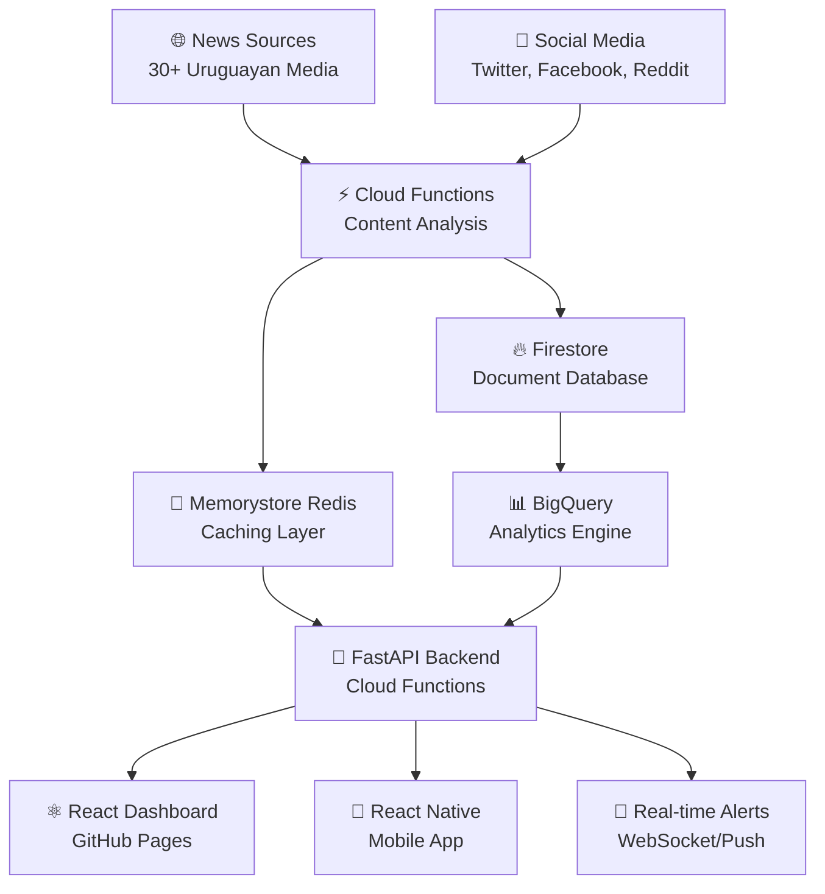

# Uruguay News Monitoring & Analysis System
## AI-Driven Open Source Project Concept

[](https://opensource.org/licenses/MIT)
[](https://github.com/features/copilot)
[](https://modelcontextprotocol.io/)
[](https://cloud.google.com/)

> 🤖 **Revolutionary AI-Driven Development Project** - This entire project will be developed through AI assistance (Claude, Cursor AI, GitHub Copilot) guided by experienced engineers, utilizing cutting-edge development methodologies including Model Context Protocol (MCP) and automated code reviews.

---

## ⚠️ **Important Development Disclaimers**

### 🤖 **AI-First Development Methodology**
- **Primary Development**: This project is being developed using AI assistants (Claude Sonnet, Cursor AI, GitHub Copilot)
- **Human Oversight**: Experienced engineers provide guidance, review, and strategic direction
- **Experimental Approach**: We're pioneering AI-driven development workflows for complex applications
- **Learning Project**: This serves as both a functional news platform and a case study in AI-assisted development

### 📋 **Development Workflow**
- **Repository Foundation**: This README establishes the project concept and architecture
- **Pull Request Based**: All future development will be done through PRs for CodeRabbit AI reviews
- **Community Driven**: Open to contributions from developers interested in AI-assisted workflows
- **Milestone Based**: No fixed timelines - development pace adapts to AI assistance capabilities

### 🔬 **Experimental Technologies**
- **Model Context Protocol (MCP)**: Cutting-edge AI-tool integration standard
- **Google Cloud Serverless**: Cost-effective, auto-scaling infrastructure
- **LangChain/LangGraph**: Multi-agent AI workflows for news analysis
- **UV Package Manager**: 10-100x faster Python dependency management

---

## 🇺🇾 **Project Vision: Transforming Uruguay's Media Landscape**

A revolutionary open-source platform that combines advanced AI analysis with transparent journalism to foster informed democratic participation in Uruguay. By monitoring 30+ news sources and applying sophisticated bias detection, we aim to combat misinformation and enhance media literacy.

### 🎯 **Core Objectives**

- **🔍 Comprehensive Monitoring**: Track traditional media, digital outlets, and social platforms
- **🤖 Advanced AI Analysis**: Spanish sentiment analysis with 84%+ accuracy, cultural context awareness
- **⚖️ Bias Detection**: LangBiTe methodology with 300+ prompts for political bias identification
- **📊 Real-Time Dashboard**: Interactive visualizations of Uruguay's media landscape
- **📱 Accessible Interface**: Web and mobile applications for broad citizen engagement
- **🎓 Educational Impact**: Promote media literacy and critical thinking

## 🏗️ **Revolutionary Architecture**

### **Google Cloud Serverless-First**


### **🤖 AI-Powered Core Features**
- **Spanish Language Mastery**: Transformer models optimized for Uruguayan cultural context
- **Political Bias Detection**: Advanced algorithms trained on Uruguayan political spectrum
- **Real-time Processing**: <200ms response times with intelligent caching
- **Multi-modal Analysis**: Text, image, video, and audio content processing
- **Fact-checking Integration**: Automated verification against trusted sources

## 🛠️ **Technology Stack (Google Cloud Focus)**

### **Backend Infrastructure**
- **🔥 Google Firestore** - NoSQL document database (1GB + 50K reads/day free)
- **⚡ Google Cloud Functions** - Serverless API endpoints (2M invocations/month free)  
- **🧠 Google Memorystore Redis** - Managed caching service
- **📊 Google BigQuery** - Data analytics (1TB queries/month free)
- **🔍 Google Vertex AI** - Future AI model deployment
- **🌐 Google Cloud CDN** - Global content delivery

### **Development Tools**
- **🚀 UV Package Manager** - 10-100x faster than pip
- **🎯 FastAPI** - High-performance Python framework with @functions_framework.http
- **🔧 MCP Servers** - 11 specialized servers for development automation
- **🤖 CodeRabbit** - AI-powered code reviews
- **📝 Cursor AI** - Advanced AI-assisted development environment

### **Frontend & Mobile**
- **⚛️ React 18 + TypeScript** - Modern web interface deployed on GitHub Pages
- **🎨 Tailwind CSS + Shadcn/ui** - Beautiful, responsive design system
- **📱 React Native + Expo** - Cross-platform mobile application
- **📈 D3.js/Recharts** - Interactive data visualizations
- **🔔 Push Notifications** - Real-time alerts and updates

### **AI & Analysis**
- **🧠 OpenAI GPT-4** - Advanced language understanding (migrating to Gemini)
- **🎭 LangChain/LangGraph** - Multi-agent AI orchestration
- **⚖️ LangBiTe** - Open-source bias detection with 300+ prompts
- **🗣️ Whisper** - Audio transcription and analysis
- **👁️ Computer Vision** - Image and video content analysis

## 🎯 **Target News Sources (30+ Outlets)**

### **Diarios y Semanarios Nacionales**
- **El País** ([elpais.com.uy](https://www.elpais.com.uy)) - Centro-derecha, 50–80 artículos/día
- **El Observador** ([elobservador.com.uy](https://www.elobservador.com.uy)) - Centro-derecha, 60–100 artículos/día
- **La Diaria** ([ladiaria.com.uy](https://ladiaria.com.uy)) - Izquierda progresista, 20–35 artículos/día
- **La República** ([larepublica.com.uy](https://www.larepublica.com.uy)) - Centrista, 20–30 artículos/día
- **Búsqueda** ([busqueda.com.uy](https://www.busqueda.com.uy)) - Semanario político-económico centrista

### **Portales Digitales y Agencias**
- **Montevideo Portal** ([montevideo.com.uy](https://www.montevideo.com.uy)) - Centro-neutral, 100–150 artículos/día
- **La Red 21** ([lr21.com.uy](https://www.lr21.com.uy)) - Centro-izquierda, 40–60 artículos/día
- **UYPress** ([uypress.net](https://www.uypress.net)) - Agencia neutral, 40–60 notas/día
- **Portal 180** ([180.com.uy](https://www.180.com.uy)) - Progresista, 15–25 piezas/día

### **Medios Audiovisuales**
- **Teledoce** ([teledoce.com](https://www.teledoce.com)) - Canal líder, multiplataforma
- **Canal 10** ([canal10.com.uy](https://www.canal10.com.uy)) - Tradicional, noticias centrales
- **VTV** ([vtv.com.uy](https://www.vtv.com.uy)) - Estatal, cobertura oficial

## 📊 **Performance & Impact Goals**

### **Technical Performance**
- **⚡ 10x Performance** through serverless architecture
- **💰 60% Cost Reduction** via Google Cloud free tiers
- **🚀 <200ms Response** API performance targets
- **🎯 84%+ Accuracy** in Spanish sentiment analysis
- **🔄 99.9% Uptime** with Google Cloud SLA

### **Democratic Impact**
- **📚 Media Literacy**: Enhanced critical thinking through transparent algorithms
- **⚖️ Bias Awareness**: Real-time political bias detection and reporting
- **🎓 Educational Partnerships**: Collaboration with Uruguayan universities
- **🌍 Open Source**: Transparent, community-auditable algorithms
- **🤝 Civic Engagement**: Tools for informed democratic participation

## 🚀 **Development Roadmap (Milestone-Based)**

### **Milestone 1: Foundation** 
- ✅ Project architecture and documentation
- 🔄 Google Cloud infrastructure setup (Firestore, Cloud Functions)
- 🔄 Basic news scraping pipeline
- 🔄 Spanish sentiment analysis implementation
- 🔄 React dashboard with real-time updates

### **Milestone 2: Enhancement**
- 🔄 LangBiTe bias detection integration
- 🔄 Real-time alerts and notifications  
- 🔄 Mobile application development
- 🔄 BigQuery analytics dashboard
- 🔄 Community contribution system

### **Milestone 3: Community**
- 🔄 Performance optimization and cost reduction
- 🔄 Educational resources and documentation
- 🔄 Academic partnerships and research collaboration
- 🔄 Advanced AI features and model improvements

## 🤝 **Contributing to AI-Driven Development**

### **How to Participate**
1. **🍴 Fork & Watch** - Fork the repository and watch for AI development updates
2. **🐛 Issues First** - Use GitHub Issues for feature requests and bug reports
3. **🔍 CodeRabbit Reviews** - All PRs reviewed by AI before human review
4. **🤖 AI-Assisted PRs** - Contributions can leverage AI tools (encouraged!)
5. **📚 Learn & Share** - Document AI development patterns and learnings

### **Development Environment**
```bash
# Quick setup with UV (ultra-fast package manager)
git clone https://github.com/yourusername/uruguay-news.git
cd uruguay-news

# Install UV and dependencies
curl -LsSf https://astral.sh/uv/install.sh | sh
uv sync

# Setup MCP servers for AI-assisted development
cp .cursor/mcp.env.template .cursor/mcp.env
# Fill in your API keys in .cursor/mcp.env
```

### **AI Development Tools Included**
- **🔧 11 MCP Servers** - GitHub, web scraping, databases, search, cloud services
- **🤖 CodeRabbit Integration** - Automated code quality analysis
- **📝 Cursor AI Rules** - 8 specialized development guidelines
- **⚡ Cloud Functions** - Serverless development with local emulation

## 🔐 **Security & Transparency**

### **Open Source Principles**
- **🔓 MIT License** - Permissive licensing for broad adoption
- **👀 Transparent Algorithms** - All bias detection and analysis code open
- **🔍 Auditable AI** - Model decisions and training data documented
- **🛡️ Privacy First** - No personal data collection, anonymous analytics only

### **Security Measures**
- **🔐 Google Cloud Security** - Enterprise-grade infrastructure
- **🔑 API Key Management** - Secure credential handling
- **🚨 Automated Monitoring** - Real-time security and performance alerts
- **📊 Transparent Metrics** - Public dashboards for system performance

## 📞 **Connect & Support**

### **Community Channels**
- **💬 GitHub Discussions** - Feature requests and community chat
- **🐛 GitHub Issues** - Bug reports and development coordination  
- **📱 Twitter/X** - [@UruguayNews](https://twitter.com/UruguayNews) - Updates and announcements
- **📧 Email** - contact@uruguay-news.ai - Direct communication

### **Academic Collaboration**
- **🎓 Universidad de la República** - Research partnerships welcome
- **📊 Data Science Community** - Open datasets for research
- **📝 Publications** - Academic papers on AI-driven journalism
- **👨‍🏫 Educational Workshops** - Media literacy and AI ethics

---

## 📜 **License & Acknowledgments**

**MIT License** - See [LICENSE](LICENSE) for full terms

### **Special Recognition**
- **🤖 Anthropic Claude** - Primary AI development assistant
- **💻 Cursor AI** - Advanced development environment and MCP integration
- **🔍 GitHub Copilot** - Code completion and suggestions
- **🔎 CodeRabbit** - AI-powered code reviews
- **☁️ Google Cloud** - Serverless infrastructure and AI services
- **🇺🇾 Uruguay's Media** - Quality journalism foundation

---

<div align="center">
  <h3>🤖 Built with AI for Uruguay's Democratic Future</h3>
  <p><strong>Pioneering AI-Driven Open Source Development</strong></p>
  <p>🇺🇾 Fostering informed citizenship through transparent, AI-powered journalism analysis</p>
  
  <br/>
  
  **Next Steps**: All future development through Pull Requests with CodeRabbit AI reviews 
</div>
