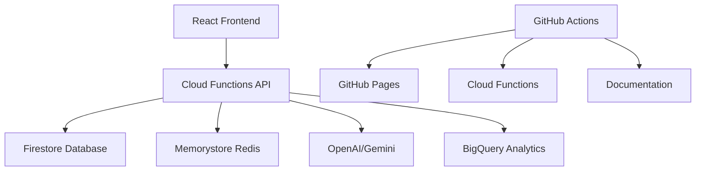

# Uruguay News Analysis System

[](https://github.com/juanfkurucz/uruguay-news/actions/workflows/deploy.yml)
[](https://github.com/juanfkurucz/uruguay-news/actions/workflows/docs.yml)
[](https://opensource.org/licenses/MIT)

> **AI-powered news analysis platform for Uruguay** with sentiment analysis, bias detection, and real-time content processing using Google Cloud serverless architecture.

## 🌟 Features

- **Spanish Sentiment Analysis**: 84%+ accuracy optimized for Uruguayan context
- **LangBiTe Bias Detection**: 300+ prompts for comprehensive political bias analysis
- **Real-time Processing**: <200ms response times with intelligent caching
- **Google Cloud Serverless**: Cost-effective, auto-scaling architecture
- **Modern Tech Stack**: FastAPI, React, Firestore, UV package management
- **Open Source**: MIT license with transparent algorithms

## 🚀 Quick Start

### Prerequisites

- Python 3.11+
- Node.js 18+
- [UV](https://docs.astral.sh/uv/) (ultra-fast Python package manager)
- Google Cloud account (for deployment)

### Installation

```bash
# Clone the repository
git clone https://github.com/juanfkurucz/uruguay-news.git
cd uruguay-news

# Install UV (if not already installed)
curl -LsSf https://astral.sh/uv/install.sh | sh

# Install Python dependencies
uv sync

# Install frontend dependencies
cd frontend/web
npm install
```

### Development

```bash
# Start backend (from project root)
cd backend
uv run uvicorn main:app --reload

# Start frontend (in new terminal)
cd frontend/web
npm start

# Start documentation (in new terminal)
uv run mkdocs serve
```

Visit:
- **Backend API**: http://localhost:8080
- **Frontend**: http://localhost:3000
- **Documentation**: http://localhost:8000

## 📖 Documentation

- **[Live Documentation](https://juanfkurucz.github.io/uruguay-news/docs/)**
- **[UV Guide](docs/development/uv-guide.md)** - Package management with UV
- **[API Reference](docs/api/rest.md)** - Backend API documentation
- **[Architecture](docs/architecture/overview.md)** - System design and components

## 🏗️ Architecture

### Google Cloud Serverless-First



### Technology Stack

- **Backend**: FastAPI + Google Cloud Functions
- **Database**: Google Firestore (NoSQL)
- **Caching**: Google Memorystore (Redis)
- **Frontend**: React 18 + TypeScript + Tailwind CSS
- **AI/ML**: OpenAI models + LangChain (migrating to Gemini)
- **Package Management**: UV (10-100x faster than pip)
- **Deployment**: GitHub Actions + GitHub Pages + Google Cloud

## 🔧 Development

### Package Management with UV

This project uses [UV](https://docs.astral.sh/uv/) for ultra-fast Python package management:

```bash
# Install dependencies
uv sync

# Add new dependency
uv add requests

# Add development dependency
uv add --dev pytest

# Run Python scripts
uv run python script.py

# Run tests
uv run pytest

# Generate requirements.txt (for Cloud Functions)
uv export --format requirements-txt --output-file requirements.txt
```

### Project Structure

```
uruguay-news/
├── pyproject.toml          # UV configuration & dependencies
├── uv.lock                 # Lock file (committed)
├── backend/                # Google Cloud Functions
│   ├── main.py            # FastAPI entry point
│   ├── pyproject.toml     # Backend-specific config
│   └── src/uruguay_news/  # Python package
├── frontend/web/          # React application
│   ├── package.json       # npm dependencies
│   └── src/               # React components
├── docs/                  # MkDocs documentation
└── .github/workflows/     # CI/CD pipelines
```

### Key Commands

```bash
# Backend development
cd backend
uv sync                    # Install dependencies
uv run uvicorn main:app --reload  # Start server
uv run pytest            # Run tests
uv run ruff check .       # Lint code
uv run black .            # Format code

# Frontend development
cd frontend/web
npm install               # Install dependencies
npm start                 # Start dev server
npm run build            # Build for production
npm test                 # Run tests

# Documentation
uv sync --extra docs     # Install docs dependencies
uv run mkdocs serve      # Serve locally
uv run mkdocs build      # Build static site
```

## 🚀 Deployment

### Automatic Deployment

Push to `main` branch triggers automatic deployment:

1. **Backend**: Google Cloud Functions
2. **Frontend**: GitHub Pages
3. **Documentation**: GitHub Pages `/docs`

### Manual Deployment

```bash
# Deploy backend
cd backend
uv export --format requirements-txt --output-file requirements.txt
gcloud functions deploy uruguay-news-api --source . --entry-point main

# Deploy frontend
cd frontend/web
npm run build
npm run deploy

# Deploy documentation
uv run mkdocs gh-deploy
```

## 🔬 AI Models

### Sentiment Analysis
- **Model**: Transformer-based Spanish sentiment analysis
- **Accuracy**: 84%+ for Uruguayan context
- **Performance**: <200ms response time
- **Caching**: Redis for repeated analysis

### Bias Detection
- **Framework**: LangBiTe methodology
- **Prompts**: 300+ specialized prompts
- **Languages**: 35+ languages supported
- **Focus**: Political bias in news content

### Entity Recognition
- **Entities**: People, organizations, locations, dates
- **Context**: Uruguayan political and social context
- **Integration**: Real-time processing pipeline

## 📊 Performance Metrics

- **Response Time**: <200ms for API endpoints
- **AI Accuracy**: 84%+ for Spanish sentiment analysis
- **Uptime**: 99.9% (Google Cloud SLA)
- **Cost**: <$10/month for moderate usage
- **Scalability**: Auto-scaling serverless architecture

## 🤝 Contributing

We welcome contributions! Please see our [Contributing Guide](docs/community/contributing.md).

### Development Setup

```bash
# Fork the repository
git clone https://github.com/yourusername/uruguay-news.git
cd uruguay-news

# Install UV
curl -LsSf https://astral.sh/uv/install.sh | sh

# Set up development environment
uv sync
cd frontend/web && npm install

# Create feature branch
git checkout -b feature/your-feature

# Make changes and test
uv run pytest
npm test

# Submit pull request
```

### Code Quality

- **Python**: Ruff linting, Black formatting, mypy type checking
- **JavaScript**: ESLint, Prettier, TypeScript strict mode
- **Testing**: pytest for backend, Jest for frontend
- **Documentation**: All functions must have docstrings

## 📄 License

This project is licensed under the MIT License - see the [LICENSE](LICENSE) file for details.

## 🙏 Acknowledgments

- [LangBiTe](https://github.com/langbite/langbite) for bias detection methodology
- [OpenAI](https://openai.com/) for AI models
- [Google Cloud](https://cloud.google.com/) for serverless infrastructure
- [UV](https://docs.astral.sh/uv/) for ultra-fast package management
- Uruguay news community for feedback and support

## 📞 Support

- **Documentation**: https://juanfkurucz.github.io/uruguay-news/docs/
- **Issues**: https://github.com/juanfkurucz/uruguay-news/issues
- **Discussions**: https://github.com/juanfkurucz/uruguay-news/discussions

---

**Built with ❤️ for Uruguay's democratic engagement and media literacy**
