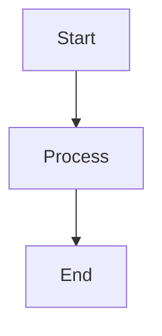

# Documentation

This directory contains the documentation for the Uruguay News Analysis System, built with [MkDocs](https://www.mkdocs.org/) and [Material for MkDocs](https://squidfunk.github.io/mkdocs-material/).

## 🚀 Quick Start

### Local Development

1. **Install dependencies**:
   ```bash
   pip install -r requirements-docs.txt
   ```

2. **Serve locally**:
   ```bash
   mkdocs serve
   ```

3. **Open in browser**: http://localhost:8000

### Build for Production

```bash
mkdocs build
```

## 📁 Structure

```
docs/
├── index.md                    # Homepage
├── getting-started/
│   ├── overview.md            # Project overview
│   ├── installation.md       # Installation guide
│   ├── configuration.md      # Configuration guide
│   └── quick-start.md        # Quick start guide
├── architecture/
│   ├── overview.md           # System architecture
│   ├── google-cloud.md      # Google Cloud services
│   ├── ai-pipeline.md       # AI processing pipeline
│   └── data-flow.md         # Data flow diagrams
├── development/
│   ├── setup.md             # Development setup
│   ├── guidelines.md        # Development guidelines
│   ├── testing.md           # Testing strategies
│   └── deployment.md        # Deployment guide
├── api/
│   ├── rest.md              # REST API reference
│   ├── graphql.md           # GraphQL API reference
│   └── websocket.md         # WebSocket API reference
├── ai/
│   ├── sentiment.md         # Sentiment analysis
│   ├── bias.md              # Bias detection
│   ├── entities.md          # Entity recognition
│   └── performance.md       # AI performance metrics
├── sources/
│   ├── uruguayan-media.md   # Uruguayan news sources
│   ├── social-media.md      # Social media integration
│   └── data-collection.md   # Data collection strategies
└── community/
    ├── contributing.md      # Contributing guidelines
    ├── code-of-conduct.md   # Code of conduct
    ├── roadmap.md          # Project roadmap
    └── changelog.md        # Changelog
```

## 🎨 Features

### Theme: Material for MkDocs
- **Dark/Light mode** toggle
- **Navigation tabs** for better organization
- **Search functionality** with highlighting
- **Code syntax highlighting** with copy buttons
- **Responsive design** for mobile devices
- **Git integration** with edit/view buttons

### Extensions
- **Admonitions**: Info, warning, tip boxes
- **Code blocks**: Syntax highlighting with copy
- **Tabbed content**: Multiple code examples
- **Mermaid diagrams**: Flowcharts and diagrams
- **Emoji support**: GitHub-style emojis
- **Table of contents**: Auto-generated navigation

### Plugins
- **Search**: Full-text search functionality
- **Git revision dates**: Last updated timestamps
- **Minification**: Optimized HTML output

## 📝 Writing Guidelines

### Markdown Features

#### Admonitions
```markdown
!!! tip "Pro Tip"
    This is a helpful tip for users.

!!! warning "Important"
    This is a warning about something critical.

!!! info "Information"
    This is additional information.
```

#### Code Blocks
```markdown
```python
def analyze_sentiment(text):
    return {"sentiment": "positive"}
```

#### Tabbed Content
```markdown
=== "Python"
    ```python
    import requests
    ```

=== "JavaScript"
    ```javascript
    const axios = require('axios');
    ```
```

#### Mermaid Diagrams
```markdown

```

### Content Guidelines

1. **Clear headings**: Use descriptive, hierarchical headings
2. **Code examples**: Include practical, working examples
3. **Cross-references**: Link to related sections
4. **Screenshots**: Add visual aids where helpful
5. **Keep it current**: Update content as the system evolves

## 🚀 Deployment

### Automatic Deployment
- **GitHub Actions**: Automatically builds and deploys on push to `main`
- **GitHub Pages**: Hosted at https://juanfkurucz.github.io/uruguay-news/
- **Branch protection**: Only deploys from main branch

### Manual Deployment
```bash
# Build and deploy
mkdocs gh-deploy

# Build only
mkdocs build
```

## 🛠️ Configuration

### MkDocs Configuration (`mkdocs.yml`)
- **Site metadata**: Title, description, author
- **Theme settings**: Colors, features, icons
- **Navigation structure**: Organized menu
- **Plugin configuration**: Search, git dates, minification
- **Markdown extensions**: Enhanced markdown features

### Requirements (`requirements-docs.txt`)
- **MkDocs**: Static site generator
- **Material theme**: Modern, responsive theme
- **Plugins**: Additional functionality
- **Extensions**: Enhanced markdown features

## 📊 Analytics

### Built-in Analytics
- **Google Analytics**: Configured in `mkdocs.yml`
- **Search metrics**: Track popular searches
- **Page views**: Monitor popular content

### Performance
- **Minification**: Optimized HTML/CSS/JS
- **Caching**: Browser caching headers
- **CDN**: GitHub Pages CDN distribution

## 🤝 Contributing

### Adding New Pages
1. Create markdown file in appropriate directory
2. Add to navigation in `mkdocs.yml`
3. Follow content guidelines
4. Test locally with `mkdocs serve`

### Updating Content
1. Edit existing markdown files
2. Follow markdown conventions
3. Update cross-references if needed
4. Test changes locally

### Reporting Issues
- **Documentation bugs**: Create GitHub issue
- **Content suggestions**: Open discussion
- **Missing information**: Request in issues

## 📚 Resources

- **MkDocs Documentation**: https://www.mkdocs.org/
- **Material Theme**: https://squidfunk.github.io/mkdocs-material/
- **Markdown Guide**: https://www.markdownguide.org/
- **Mermaid Diagrams**: https://mermaid.js.org/

---

*Documentation built with ❤️ using MkDocs and Material theme* 