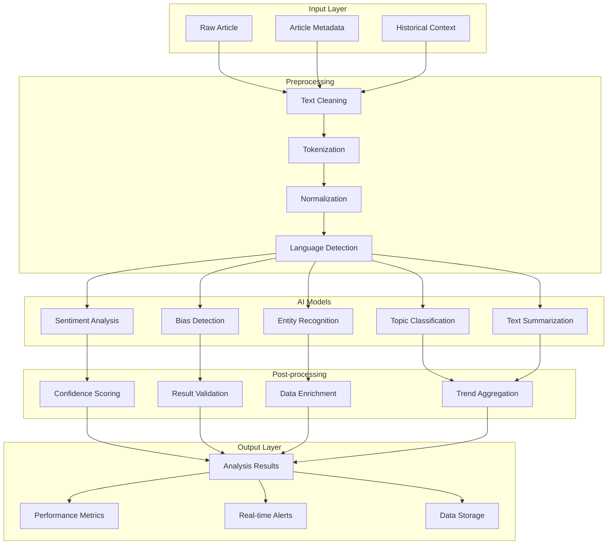

# AI Pipeline Architecture

## Overview

The AI Pipeline is the core intelligence engine of the Uruguay News Analysis System. It processes news articles through multiple stages of analysis, including sentiment analysis, bias detection, entity recognition, and trend identification. The pipeline is designed for high accuracy (84%+), low latency (<200ms), and cultural specificity for Uruguayan Spanish.

## Pipeline Architecture



## Pipeline Components

### 1. Input Layer

#### Raw Article Processing
```python
# Article input schema
class ArticleInput:
    id: str
    title: str
    content: str
    source: str
    author: Optional[str]
    published_at: datetime
    url: str
    images: List[str]
    tags: List[str]
    
    # Metadata
    word_count: int
    language: str
    category: str
    subcategory: Optional[str]
```

#### Context Enrichment
```python
# Historical context integration
class ContextEnricher:
    def __init__(self, firestore_client, redis_client):
        self.db = firestore_client
        self.cache = redis_client
    
    def enrich_article(self, article: ArticleInput) -> EnrichedArticle:
        """Add historical context and related articles"""
        
        # Get related articles
        related = self.get_related_articles(article)
        
        # Get historical trends
        trends = self.get_historical_trends(article.category)
        
        # Get author context
        author_context = self.get_author_context(article.author)
        
        return EnrichedArticle(
            article=article,
            related_articles=related,
            historical_trends=trends,
            author_context=author_context
        )
```

### 2. Preprocessing Pipeline

#### Text Cleaning
```python
# Uruguayan Spanish text preprocessing
class UruguayanTextCleaner:
    def __init__(self):
        self.uruguayan_stopwords = self.load_uruguayan_stopwords()
        self.slang_dict = self.load_uruguayan_slang()
        self.political_terms = self.load_political_terms()
    
    def clean_text(self, text: str) -> str:
        """Clean and normalize Uruguayan Spanish text"""
        
        # Remove HTML tags and special characters
        text = self.remove_html_tags(text)
        
        # Normalize Uruguayan slang
        text = self.normalize_slang(text)
        
        # Handle political abbreviations
        text = self.expand_political_abbreviations(text)
        
        # Remove excessive whitespace
        text = self.normalize_whitespace(text)
        
        return text
    
    def normalize_slang(self, text: str) -> str:
        """Convert Uruguayan slang to standard Spanish"""
        for slang, standard in self.slang_dict.items():
            text = text.replace(slang, standard)
        return text
```

#### Tokenization & Normalization
```python
# Advanced tokenization for Spanish
class SpanishTokenizer:
    def __init__(self):
        self.nlp = spacy.load("es_core_news_sm")
        self.custom_rules = self.load_custom_rules()
    
    def tokenize(self, text: str) -> List[Token]:
        """Tokenize Spanish text with custom rules"""
        doc = self.nlp(text)
        
        tokens = []
        for token in doc:
            if not token.is_stop and not token.is_punct:
                tokens.append(Token(
                    text=token.text,
                    lemma=token.lemma_,
                    pos=token.pos_,
                    tag=token.tag_,
                    dep=token.dep_,
                    sentiment=self.get_token_sentiment(token)
                ))
        
        return tokens
```

### 3. AI Models

#### Sentiment Analysis
```python
# Uruguayan Spanish sentiment analysis
class UruguayanSentimentAnalyzer:
    def __init__(self):
        self.model = self.load_fine_tuned_model()
        self.emotion_detector = self.load_emotion_model()
        self.cultural_context = self.load_cultural_context()
    
    def analyze_sentiment(self, text: str, context: dict) -> SentimentResult:
        """Analyze sentiment with cultural context"""
        
        # Base sentiment analysis
        base_sentiment = self.model.predict(text)
        
        # Emotion detection
        emotions = self.emotion_detector.predict(text)
        
        # Cultural adjustment
        adjusted_sentiment = self.adjust_for_culture(
            base_sentiment, 
            emotions, 
            context
        )
        
        return SentimentResult(
            score=adjusted_sentiment.score,
            confidence=adjusted_sentiment.confidence,
            emotions=emotions,
            cultural_factors=adjusted_sentiment.cultural_factors,
            explanation=self.generate_explanation(adjusted_sentiment)
        )
    
    def adjust_for_culture(self, sentiment, emotions, context):
        """Adjust sentiment for Uruguayan cultural context"""
        
        # Uruguayan communication patterns
        if context.get('source') in ['El País', 'El Observador']:
            # Formal media - more conservative scoring
            sentiment.score *= 0.9
        elif context.get('source') in ['La Diaria', 'Caras y Caretas']:
            # Alternative media - more expressive scoring
            sentiment.score *= 1.1
        
        # Political context adjustments
        if 'política' in context.get('category', ''):
            sentiment = self.adjust_political_sentiment(sentiment, context)
        
        return sentiment
```

#### Bias Detection
```python
# LangBiTe-based bias detection
class BiasDetector:
    def __init__(self):
        self.langbite_model = self.load_langbite_model()
        self.uruguayan_bias_patterns = self.load_bias_patterns()
        self.political_spectrum = self.load_political_spectrum()
    
    def detect_bias(self, text: str, context: dict) -> BiasResult:
        """Detect political and ideological bias"""
        
        # LangBiTe analysis with 300+ prompts
        langbite_result = self.langbite_model.analyze(text)
        
        # Uruguayan-specific bias patterns
        local_bias = self.analyze_local_bias(text, context)
        
        # Political spectrum analysis
        political_bias = self.analyze_political_bias(text, context)
        
        # Combine results
        final_bias = self.combine_bias_results(
            langbite_result,
            local_bias,
            political_bias
        )
        
        return BiasResult(
            score=final_bias.score,
            direction=final_bias.direction,
            confidence=final_bias.confidence,
            evidence=final_bias.evidence,
            political_spectrum=political_bias.spectrum,
            bias_type=final_bias.type,
            explanation=self.generate_bias_explanation(final_bias)
        )
    
    def analyze_local_bias(self, text: str, context: dict) -> LocalBiasResult:
        """Analyze Uruguay-specific bias patterns"""
        
        bias_indicators = []
        
        # Political party references
        for party, indicators in self.uruguayan_bias_patterns.items():
            if any(indicator in text.lower() for indicator in indicators):
                bias_indicators.append({
                    'party': party,
                    'strength': self.calculate_bias_strength(text, indicators),
                    'evidence': self.extract_evidence(text, indicators)
                })
        
        return LocalBiasResult(
            indicators=bias_indicators,
            overall_direction=self.determine_overall_direction(bias_indicators),
            confidence=self.calculate_confidence(bias_indicators)
        )
```

#### Entity Recognition
```python
# Uruguayan entity recognition
class UruguayanEntityRecognizer:
    def __init__(self):
        self.ner_model = self.load_ner_model()
        self.uruguayan_entities = self.load_uruguayan_entities()
        self.political_entities = self.load_political_entities()
    
    def recognize_entities(self, text: str) -> List[Entity]:
        """Recognize Uruguayan-specific entities"""
        
        # Base NER
        base_entities = self.ner_model.predict(text)
        
        # Uruguayan-specific entities
        local_entities = self.recognize_local_entities(text)
        
        # Political entities
        political_entities = self.recognize_political_entities(text)
        
        # Merge and deduplicate
        all_entities = self.merge_entities(
            base_entities,
            local_entities,
            political_entities
        )
        
        # Add sentiment to entities
        for entity in all_entities:
            entity.sentiment = self.get_entity_sentiment(entity, text)
        
        return all_entities
    
    def recognize_local_entities(self, text: str) -> List[Entity]:
        """Recognize Uruguay-specific entities"""
        
        entities = []
        
        # Uruguayan politicians
        for politician in self.uruguayan_entities['politicians']:
            if politician['name'].lower() in text.lower():
                entities.append(Entity(
                    name=politician['name'],
                    type='PERSON',
                    subtype='POLITICIAN',
                    party=politician.get('party'),
                    position=politician.get('position'),
                    confidence=0.95
                ))
        
        # Uruguayan locations
        for location in self.uruguayan_entities['locations']:
            if location['name'].lower() in text.lower():
                entities.append(Entity(
                    name=location['name'],
                    type='LOCATION',
                    subtype=location['type'],
                    department=location.get('department'),
                    confidence=0.90
                ))
        
        return entities
```

#### Topic Classification
```python
# News topic classification
class TopicClassifier:
    def __init__(self):
        self.classification_model = self.load_classification_model()
        self.uruguayan_topics = self.load_uruguayan_topics()
        self.topic_hierarchy = self.load_topic_hierarchy()
    
    def classify_topic(self, text: str, context: dict) -> TopicResult:
        """Classify article into Uruguayan news topics"""
        
        # Primary classification
        primary_topic = self.classification_model.predict(text)
        
        # Uruguayan-specific topics
        local_topics = self.classify_local_topics(text)
        
        # Hierarchical classification
        topic_hierarchy = self.build_topic_hierarchy(primary_topic, local_topics)
        
        return TopicResult(
            primary_topic=primary_topic,
            secondary_topics=local_topics,
            hierarchy=topic_hierarchy,
            confidence=self.calculate_topic_confidence(primary_topic, local_topics),
            tags=self.generate_topic_tags(primary_topic, local_topics)
        )
    
    def classify_local_topics(self, text: str) -> List[LocalTopic]:
        """Classify Uruguay-specific topics"""
        
        local_topics = []
        
        # Political topics
        if self.is_political_content(text):
            local_topics.append(LocalTopic(
                name='política_uruguaya',
                confidence=0.85,
                subtopics=self.extract_political_subtopics(text)
            ))
        
        # Economic topics
        if self.is_economic_content(text):
            local_topics.append(LocalTopic(
                name='economía_uruguaya',
                confidence=0.80,
                subtopics=self.extract_economic_subtopics(text)
            ))
        
        return local_topics
```

### 4. Post-processing Pipeline

#### Confidence Scoring
```python
# Confidence scoring system
class ConfidenceScorer:
    def __init__(self):
        self.confidence_models = self.load_confidence_models()
        self.uncertainty_quantifiers = self.load_uncertainty_quantifiers()
    
    def calculate_confidence(self, results: dict) -> ConfidenceScore:
        """Calculate overall confidence in analysis results"""
        
        individual_confidences = {}
        
        # Sentiment confidence
        individual_confidences['sentiment'] = self.calculate_sentiment_confidence(
            results['sentiment']
        )
        
        # Bias confidence
        individual_confidences['bias'] = self.calculate_bias_confidence(
            results['bias']
        )
        
        # Entity confidence
        individual_confidences['entities'] = self.calculate_entity_confidence(
            results['entities']
        )
        
        # Overall confidence
        overall_confidence = self.calculate_overall_confidence(
            individual_confidences
        )
        
        return ConfidenceScore(
            overall=overall_confidence,
            individual=individual_confidences,
            uncertainty_factors=self.identify_uncertainty_factors(results),
            reliability_score=self.calculate_reliability_score(results)
        )
```

#### Result Validation
```python
# Result validation and quality assurance
class ResultValidator:
    def __init__(self):
        self.validation_rules = self.load_validation_rules()
        self.quality_thresholds = self.load_quality_thresholds()
    
    def validate_results(self, results: dict) -> ValidationResult:
        """Validate analysis results for quality and consistency"""
        
        validation_results = {}
        
        # Sentiment validation
        validation_results['sentiment'] = self.validate_sentiment(
            results['sentiment']
        )
        
        # Bias validation
        validation_results['bias'] = self.validate_bias(
            results['bias']
        )
        
        # Entity validation
        validation_results['entities'] = self.validate_entities(
            results['entities']
        )
        
        # Cross-validation
        cross_validation = self.cross_validate_results(results)
        
        return ValidationResult(
            individual_validation=validation_results,
            cross_validation=cross_validation,
            quality_score=self.calculate_quality_score(validation_results),
            recommendations=self.generate_recommendations(validation_results)
        )
```

### 5. Model Integration

#### OpenAI Integration
```python
# OpenAI model integration
class OpenAIIntegration:
    def __init__(self):
        self.client = OpenAI(api_key=get_secret("openai-api-key"))
        self.model_configs = self.load_model_configs()
    
    def analyze_with_gpt(self, text: str, task: str) -> dict:
        """Use GPT models for specific analysis tasks"""
        
        prompt = self.build_prompt(text, task)
        
        response = self.client.chat.completions.create(
            model="gpt-4",
            messages=[
                {"role": "system", "content": self.get_system_prompt(task)},
                {"role": "user", "content": prompt}
            ],
            temperature=0.1,
            max_tokens=1000
        )
        
        return self.parse_response(response.choices[0].message.content, task)
    
    def get_system_prompt(self, task: str) -> str:
        """Get system prompt for specific task"""
        
        base_prompt = """You are an expert in Uruguayan news analysis. 
        You understand the cultural context, political landscape, and linguistic nuances 
        of Uruguay. Provide accurate, culturally-aware analysis."""
        
        task_prompts = {
            'sentiment': base_prompt + " Focus on sentiment analysis with cultural context.",
            'bias': base_prompt + " Focus on political bias detection in Uruguayan context.",
            'summary': base_prompt + " Focus on creating concise, accurate summaries."
        }
        
        return task_prompts.get(task, base_prompt)
```

#### Vertex AI Integration (Future)
```python
# Vertex AI integration for custom models
class VertexAIIntegration:
    def __init__(self):
        self.client = aiplatform.gapic.PredictionServiceClient()
        self.endpoints = self.load_model_endpoints()
    
    def predict_with_custom_model(self, text: str, model_name: str) -> dict:
        """Use custom Vertex AI models for prediction"""
        
        endpoint = self.endpoints[model_name]
        
        # Prepare input
        instance = {
            "text": text,
            "config": {
                "max_length": 512,
                "temperature": 0.1
            }
        }
        
        # Make prediction
        response = self.client.predict(
            endpoint=endpoint,
            instances=[instance]
        )
        
        return self.parse_vertex_response(response.predictions[0])
```

### 6. Performance Optimization

#### Caching Strategy
```python
# Intelligent caching for AI results
class AIResultCache:
    def __init__(self, redis_client):
        self.redis = redis_client
        self.cache_strategies = self.load_cache_strategies()
    
    def get_cached_result(self, text_hash: str, model_version: str) -> Optional[dict]:
        """Get cached AI analysis result"""
        
        cache_key = f"ai_result:{text_hash}:{model_version}"
        cached_result = self.redis.get(cache_key)
        
        if cached_result:
            return json.loads(cached_result)
        
        return None
    
    def cache_result(self, text_hash: str, model_version: str, result: dict, ttl: int = 3600):
        """Cache AI analysis result"""
        
        cache_key = f"ai_result:{text_hash}:{model_version}"
        
        # Add metadata
        cached_data = {
            'result': result,
            'cached_at': datetime.utcnow().isoformat(),
            'cache_version': '1.0'
        }
        
        self.redis.setex(cache_key, ttl, json.dumps(cached_data))
```

#### Batch Processing
```python
# Batch processing for high-volume analysis
class BatchProcessor:
    def __init__(self):
        self.batch_size = 50
        self.processing_queue = Queue()
        self.result_storage = self.initialize_storage()
    
    def process_batch(self, articles: List[Article]) -> List[AnalysisResult]:
        """Process multiple articles in batch"""
        
        results = []
        
        # Group by processing requirements
        batches = self.group_articles_by_requirements(articles)
        
        for batch in batches:
            # Process batch
            batch_results = self.process_article_batch(batch)
            results.extend(batch_results)
        
        return results
    
    def process_article_batch(self, articles: List[Article]) -> List[AnalysisResult]:
        """Process a single batch of articles"""
        
        # Parallel processing
        with concurrent.futures.ThreadPoolExecutor(max_workers=10) as executor:
            futures = [
                executor.submit(self.analyze_article, article)
                for article in articles
            ]
            
            results = []
            for future in concurrent.futures.as_completed(futures):
                try:
                    result = future.result()
                    results.append(result)
                except Exception as e:
                    logging.error(f"Error processing article: {e}")
            
            return results
```

### 7. Real-time Processing

#### Streaming Pipeline
```python
# Real-time streaming analysis
class StreamingProcessor:
    def __init__(self):
        self.pubsub_client = pubsub_v1.SubscriberClient()
        self.subscription_path = self.pubsub_client.subscription_path(
            PROJECT_ID, 'news-analysis-stream'
        )
    
    def process_stream(self):
        """Process real-time news stream"""
        
        def callback(message):
            try:
                # Parse message
                article_data = json.loads(message.data.decode('utf-8'))
                
                # Quick analysis for urgent content
                if article_data.get('priority') == 'urgent':
                    result = self.quick_analysis(article_data)
                    self.send_urgent_alert(result)
                
                # Queue for full analysis
                self.queue_for_full_analysis(article_data)
                
                message.ack()
                
            except Exception as e:
                logging.error(f"Error processing stream message: {e}")
                message.nack()
        
        # Start streaming
        streaming_pull_future = self.pubsub_client.subscribe(
            self.subscription_path,
            callback=callback
        )
        
        return streaming_pull_future
```

## Performance Metrics

### Accuracy Benchmarks
```python
# Performance monitoring and benchmarks
class PerformanceMonitor:
    def __init__(self):
        self.benchmarks = self.load_benchmarks()
        self.performance_history = self.load_performance_history()
    
    def track_performance(self, task: str, result: dict, ground_truth: dict = None):
        """Track AI model performance"""
        
        if ground_truth:
            accuracy = self.calculate_accuracy(result, ground_truth)
        else:
            accuracy = self.estimate_accuracy(result)
        
        performance_data = {
            'task': task,
            'accuracy': accuracy,
            'confidence': result.get('confidence', 0),
            'processing_time': result.get('processing_time', 0),
            'timestamp': datetime.utcnow().isoformat()
        }
        
        # Store in BigQuery
        self.store_performance_data(performance_data)
        
        # Update running averages
        self.update_running_averages(task, performance_data)
```

### Current Performance Targets
- **Sentiment Analysis**: 84%+ accuracy
- **Bias Detection**: 78%+ accuracy  
- **Entity Recognition**: 90%+ accuracy
- **Response Time**: <200ms average
- **Availability**: 99.9% uptime

## Future Enhancements

### Planned Improvements
1. **Custom Model Training**: Fine-tune models on Uruguayan data
2. **Multi-modal Analysis**: Include image and video analysis
3. **Real-time Adaptation**: Dynamic model updates
4. **Federated Learning**: Collaborative model improvement
5. **Explainable AI**: Better result interpretation

### Research Areas
- **Cultural Sentiment Analysis**: Deeper cultural understanding
- **Political Bias Evolution**: Track bias changes over time
- **Social Media Integration**: Include social media sentiment
- **Fact-checking**: Automated fact verification

## Next Steps

1. **Review** the AI pipeline architecture
2. **Understand** each component's role
3. **Implement** custom models for your use case
4. **Monitor** performance and accuracy
5. **Optimize** based on real-world usage

For more information, see:
- [Google Cloud Services](google-cloud.md)
- [Data Flow Architecture](data-flow.md)
- [AI Models Documentation](../ai/sentiment.md)
- [Performance Monitoring](../ai/performance.md) 