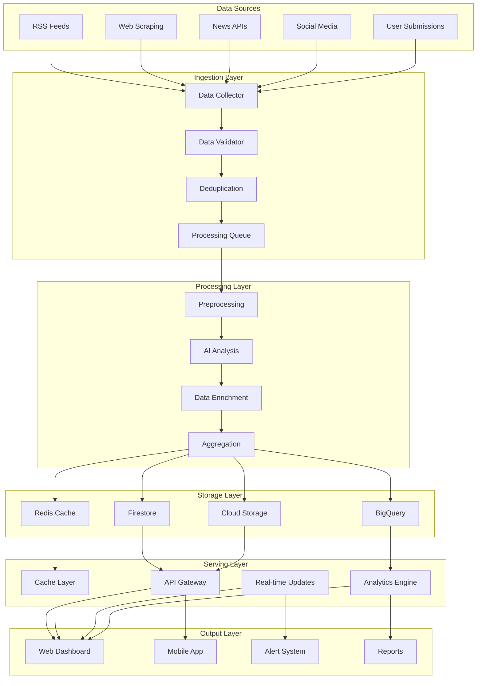

# Data Flow Architecture

## Overview

The Uruguay News Analysis System processes news data through a sophisticated multi-stage pipeline that ensures high-quality analysis, efficient storage, and real-time insights. This document details the complete data flow from initial collection to final delivery.

## High-Level Data Flow



## Data Collection Layer

### News Source Integration

#### RSS Feed Processing
```python
# RSS feed data collection
class RSSCollector:
    def __init__(self):
        self.feeds = self.load_rss_feeds()
        self.parser = feedparser
        self.rate_limiter = RateLimiter(requests_per_minute=60)
    
    def collect_rss_data(self) -> List[RawArticle]:
        """Collect articles from RSS feeds"""
        
        articles = []
        
        for feed_url in self.feeds:
            try:
                with self.rate_limiter:
                    # Parse RSS feed
                    feed = self.parser.parse(feed_url)
                    
                    for entry in feed.entries:
                        article = RawArticle(
                            title=entry.title,
                            content=entry.summary,
                            url=entry.link,
                            published_at=self.parse_date(entry.published),
                            source=feed.feed.title,
                            category=self.extract_category(entry),
                            raw_data=entry
                        )
                        articles.append(article)
                        
            except Exception as e:
                logging.error(f"Error collecting RSS from {feed_url}: {e}")
        
        return articles
```

#### Web Scraping
```python
# Web scraping for full article content
class WebScraper:
    def __init__(self):
        self.scrapers = self.load_site_scrapers()
        self.session = requests.Session()
        self.session.headers.update({
            'User-Agent': 'Uruguay-News-Bot/1.0 (Educational Purpose)'
        })
    
    def scrape_article(self, url: str, source: str) -> ScrapedArticle:
        """Scrape full article content"""
        
        scraper = self.scrapers.get(source)
        if not scraper:
            scraper = self.scrapers['default']
        
        try:
            response = self.session.get(url, timeout=10)
            response.raise_for_status()
            
            # Parse content
            soup = BeautifulSoup(response.content, 'html.parser')
            
            # Extract using source-specific rules
            content = scraper.extract_content(soup)
            metadata = scraper.extract_metadata(soup)
            
            return ScrapedArticle(
                url=url,
                title=metadata.get('title'),
                content=content,
                author=metadata.get('author'),
                published_at=metadata.get('published_at'),
                images=metadata.get('images', []),
                tags=metadata.get('tags', []),
                word_count=len(content.split()),
                language=self.detect_language(content)
            )
            
        except Exception as e:
            logging.error(f"Error scraping {url}: {e}")
            return None
```

#### API Integration
```python
# News API integration
class NewsAPICollector:
    def __init__(self):
        self.apis = self.load_api_configurations()
        self.rate_limiters = self.setup_rate_limiters()
    
    def collect_from_apis(self) -> List[APIArticle]:
        """Collect from news APIs"""
        
        articles = []
        
        for api_name, config in self.apis.items():
            try:
                with self.rate_limiters[api_name]:
                    # API-specific collection
                    api_articles = self.collect_from_api(api_name, config)
                    articles.extend(api_articles)
                    
            except Exception as e:
                logging.error(f"Error collecting from {api_name}: {e}")
        
        return articles
    
    def collect_from_api(self, api_name: str, config: dict) -> List[APIArticle]:
        """Collect from specific API"""
        
        if api_name == 'newsapi':
            return self.collect_from_newsapi(config)
        elif api_name == 'google_news':
            return self.collect_from_google_news(config)
        else:
            return self.collect_from_generic_api(api_name, config)
```

### Data Validation

#### Content Validation
```python
# Data validation and quality checks
class DataValidator:
    def __init__(self):
        self.validation_rules = self.load_validation_rules()
        self.quality_thresholds = self.load_quality_thresholds()
    
    def validate_article(self, article: RawArticle) -> ValidationResult:
        """Validate article data quality"""
        
        validation_results = {}
        
        # Required fields validation
        validation_results['required_fields'] = self.validate_required_fields(article)
        
        # Content quality validation
        validation_results['content_quality'] = self.validate_content_quality(article)
        
        # Source credibility validation
        validation_results['source_credibility'] = self.validate_source_credibility(article)
        
        # Duplicate detection
        validation_results['duplicate_check'] = self.check_for_duplicates(article)
        
        # Language validation
        validation_results['language_check'] = self.validate_language(article)
        
        # Overall quality score
        quality_score = self.calculate_quality_score(validation_results)
        
        return ValidationResult(
            is_valid=quality_score >= self.quality_thresholds['minimum'],
            quality_score=quality_score,
            validation_results=validation_results,
            recommendations=self.generate_recommendations(validation_results)
        )
    
    def validate_content_quality(self, article: RawArticle) -> ContentQualityResult:
        """Validate content quality"""
        
        content_metrics = {
            'word_count': len(article.content.split()),
            'sentence_count': len(article.content.split('.')),
            'paragraph_count': len(article.content.split('\n\n')),
            'readability_score': self.calculate_readability(article.content),
            'spam_score': self.calculate_spam_score(article.content),
            'completeness_score': self.calculate_completeness(article)
        }
        
        return ContentQualityResult(
            metrics=content_metrics,
            is_high_quality=content_metrics['word_count'] >= 100 and
                           content_metrics['spam_score'] < 0.3,
            quality_factors=self.identify_quality_factors(content_metrics)
        )
```

#### Deduplication
```python
# Advanced deduplication system
class Deduplicator:
    def __init__(self):
        self.similarity_threshold = 0.85
        self.hash_algorithms = ['md5', 'sha256', 'simhash']
        self.embedding_model = SentenceTransformer('paraphrase-multilingual-MiniLM-L12-v2')
    
    def detect_duplicates(self, articles: List[ValidatedArticle]) -> List[DuplicateGroup]:
        """Detect duplicate articles using multiple methods"""
        
        duplicate_groups = []
        
        # Content hash-based detection
        hash_groups = self.group_by_content_hash(articles)
        
        # Semantic similarity detection
        similarity_groups = self.group_by_semantic_similarity(articles)
        
        # URL-based detection
        url_groups = self.group_by_url_similarity(articles)
        
        # Combine and merge groups
        all_groups = hash_groups + similarity_groups + url_groups
        merged_groups = self.merge_duplicate_groups(all_groups)
        
        return merged_groups
    
    def group_by_semantic_similarity(self, articles: List[ValidatedArticle]) -> List[DuplicateGroup]:
        """Group articles by semantic similarity"""
        
        # Generate embeddings
        texts = [article.title + " " + article.content[:500] for article in articles]
        embeddings = self.embedding_model.encode(texts)
        
        # Calculate similarity matrix
        similarity_matrix = cosine_similarity(embeddings)
        
        # Find similar articles
        groups = []
        processed = set()
        
        for i, article in enumerate(articles):
            if i in processed:
                continue
                
            similar_indices = np.where(similarity_matrix[i] > self.similarity_threshold)[0]
            
            if len(similar_indices) > 1:
                group_articles = [articles[j] for j in similar_indices]
                groups.append(DuplicateGroup(
                    articles=group_articles,
                    similarity_scores=similarity_matrix[i][similar_indices],
                    detection_method='semantic'
                ))
                processed.update(similar_indices)
        
        return groups
```

## Data Processing Layer

### Preprocessing Pipeline

#### Text Normalization
```python
# Text preprocessing for Uruguayan content
class TextPreprocessor:
    def __init__(self):
        self.normalizer = UruguayanTextNormalizer()
        self.cleaner = TextCleaner()
        self.tokenizer = SpanishTokenizer()
    
    def preprocess_article(self, article: ValidatedArticle) -> PreprocessedArticle:
        """Preprocess article for analysis"""
        
        # Clean and normalize text
        cleaned_title = self.cleaner.clean_text(article.title)
        cleaned_content = self.cleaner.clean_text(article.content)
        
        # Normalize for Uruguayan Spanish
        normalized_title = self.normalizer.normalize(cleaned_title)
        normalized_content = self.normalizer.normalize(cleaned_content)
        
        # Tokenize
        title_tokens = self.tokenizer.tokenize(normalized_title)
        content_tokens = self.tokenizer.tokenize(normalized_content)
        
        # Extract features
        features = self.extract_features(article, title_tokens, content_tokens)
        
        return PreprocessedArticle(
            original_article=article,
            cleaned_title=cleaned_title,
            cleaned_content=cleaned_content,
            normalized_title=normalized_title,
            normalized_content=normalized_content,
            title_tokens=title_tokens,
            content_tokens=content_tokens,
            features=features,
            preprocessing_metadata={
                'processed_at': datetime.utcnow().isoformat(),
                'preprocessing_version': '1.0',
                'word_count': len(content_tokens),
                'unique_words': len(set(token.text for token in content_tokens))
            }
        )
```

#### Feature Extraction
```python
# Feature extraction for ML models
class FeatureExtractor:
    def __init__(self):
        self.tfidf_vectorizer = TfidfVectorizer(max_features=10000)
        self.word2vec_model = Word2Vec.load('models/uruguayan_word2vec.model')
        self.feature_extractors = self.load_feature_extractors()
    
    def extract_features(self, article: PreprocessedArticle) -> FeatureVector:
        """Extract features for ML models"""
        
        features = {}
        
        # TF-IDF features
        features['tfidf'] = self.extract_tfidf_features(article.normalized_content)
        
        # Word embeddings
        features['word_embeddings'] = self.extract_word_embeddings(article.content_tokens)
        
        # Linguistic features
        features['linguistic'] = self.extract_linguistic_features(article)
        
        # Structural features
        features['structural'] = self.extract_structural_features(article)
        
        # Uruguayan-specific features
        features['uruguayan'] = self.extract_uruguayan_features(article)
        
        return FeatureVector(
            features=features,
            feature_names=self.get_feature_names(),
            extraction_metadata={
                'extraction_method': 'combined',
                'model_version': '1.0',
                'feature_count': sum(len(v) for v in features.values())
            }
        )
    
    def extract_uruguayan_features(self, article: PreprocessedArticle) -> dict:
        """Extract Uruguay-specific features"""
        
        uruguayan_features = {}
        
        # Political vocabulary
        uruguayan_features['political_vocab'] = self.count_political_terms(article)
        
        # Regional expressions
        uruguayan_features['regional_expressions'] = self.count_regional_expressions(article)
        
        # Cultural references
        uruguayan_features['cultural_references'] = self.count_cultural_references(article)
        
        # Media source characteristics
        uruguayan_features['source_characteristics'] = self.analyze_source_characteristics(article)
        
        return uruguayan_features
```

### AI Analysis Pipeline

#### Parallel Processing
```python
# Parallel AI analysis pipeline
class ParallelAnalyzer:
    def __init__(self):
        self.analyzers = {
            'sentiment': SentimentAnalyzer(),
            'bias': BiasDetector(),
            'entities': EntityRecognizer(),
            'topics': TopicClassifier(),
            'summary': TextSummarizer()
        }
        self.executor = ThreadPoolExecutor(max_workers=5)
    
    def analyze_article(self, article: PreprocessedArticle) -> AnalysisResult:
        """Analyze article using multiple AI models in parallel"""
        
        # Submit analysis tasks
        futures = {}
        for analyzer_name, analyzer in self.analyzers.items():
            future = self.executor.submit(
                self.run_analysis,
                analyzer,
                article,
                analyzer_name
            )
            futures[analyzer_name] = future
        
        # Collect results
        results = {}
        for analyzer_name, future in futures.items():
            try:
                results[analyzer_name] = future.result(timeout=30)
            except Exception as e:
                logging.error(f"Error in {analyzer_name} analysis: {e}")
                results[analyzer_name] = self.get_fallback_result(analyzer_name)
        
        # Combine results
        combined_result = self.combine_analysis_results(results, article)
        
        return combined_result
    
    def run_analysis(self, analyzer, article: PreprocessedArticle, analyzer_name: str) -> dict:
        """Run individual analysis with error handling"""
        
        start_time = time.time()
        
        try:
            # Get from cache if available
            cache_key = self.generate_cache_key(article, analyzer_name)
            cached_result = self.get_from_cache(cache_key)
            
            if cached_result:
                return cached_result
            
            # Run analysis
            result = analyzer.analyze(article)
            
            # Cache result
            processing_time = time.time() - start_time
            result['processing_time'] = processing_time
            self.cache_result(cache_key, result)
            
            return result
            
        except Exception as e:
            logging.error(f"Error in {analyzer_name}: {e}")
            return self.get_fallback_result(analyzer_name)
```

### Data Enrichment

#### Contextual Enrichment
```python
# Data enrichment with contextual information
class DataEnricher:
    def __init__(self):
        self.historical_data = HistoricalDataProvider()
        self.external_apis = ExternalAPIManager()
        self.knowledge_graph = KnowledgeGraph()
    
    def enrich_analysis(self, analysis_result: AnalysisResult) -> EnrichedAnalysis:
        """Enrich analysis with contextual information"""
        
        enrichments = {}
        
        # Historical context
        enrichments['historical'] = self.add_historical_context(analysis_result)
        
        # Related articles
        enrichments['related_articles'] = self.find_related_articles(analysis_result)
        
        # External data
        enrichments['external_data'] = self.fetch_external_data(analysis_result)
        
        # Knowledge graph connections
        enrichments['knowledge_graph'] = self.connect_to_knowledge_graph(analysis_result)
        
        # Trend analysis
        enrichments['trends'] = self.analyze_trends(analysis_result)
        
        return EnrichedAnalysis(
            original_analysis=analysis_result,
            enrichments=enrichments,
            enrichment_metadata={
                'enrichment_version': '1.0',
                'enriched_at': datetime.utcnow().isoformat(),
                'enrichment_sources': list(enrichments.keys())
            }
        )
    
    def add_historical_context(self, analysis_result: AnalysisResult) -> dict:
        """Add historical context to analysis"""
        
        # Get historical sentiment trends
        historical_sentiment = self.historical_data.get_sentiment_trends(
            source=analysis_result.source,
            category=analysis_result.category,
            time_range='30d'
        )
        
        # Get historical bias patterns
        historical_bias = self.historical_data.get_bias_patterns(
            source=analysis_result.source,
            time_range='30d'
        )
        
        # Compare with current analysis
        sentiment_comparison = self.compare_with_historical(
            analysis_result.sentiment,
            historical_sentiment
        )
        
        bias_comparison = self.compare_with_historical(
            analysis_result.bias,
            historical_bias
        )
        
        return {
            'historical_sentiment': historical_sentiment,
            'historical_bias': historical_bias,
            'sentiment_comparison': sentiment_comparison,
            'bias_comparison': bias_comparison,
            'trend_indicators': self.identify_trend_indicators(analysis_result)
        }
```

## Data Storage Layer

### Storage Strategy

#### Multi-tier Storage
```python
# Multi-tier storage architecture
class StorageManager:
    def __init__(self):
        self.firestore = firestore.Client()
        self.bigquery = bigquery.Client()
        self.redis = redis.from_url(os.getenv('REDIS_URL'))
        self.cloud_storage = storage.Client()
        
        self.storage_policies = self.load_storage_policies()
    
    def store_analysis_result(self, result: EnrichedAnalysis):
        """Store analysis result across multiple storage tiers"""
        
        # Real-time storage (Firestore)
        self.store_in_firestore(result)
        
        # Analytics storage (BigQuery)
        self.store_in_bigquery(result)
        
        # Cache storage (Redis)
        self.store_in_redis(result)
        
        # Archive storage (Cloud Storage)
        if self.should_archive(result):
            self.store_in_cloud_storage(result)
    
    def store_in_firestore(self, result: EnrichedAnalysis):
        """Store in Firestore for real-time access"""
        
        doc_ref = self.firestore.collection('articles').document(result.id)
        
        # Prepare document data
        doc_data = {
            'id': result.id,
            'title': result.title,
            'content': result.content[:1000],  # Truncate for storage
            'source': result.source,
            'published_at': result.published_at,
            'analysis': {
                'sentiment': result.sentiment.to_dict(),
                'bias': result.bias.to_dict(),
                'entities': [e.to_dict() for e in result.entities],
                'topics': result.topics.to_dict(),
                'summary': result.summary
            },
            'metadata': {
                'analyzed_at': datetime.utcnow(),
                'analysis_version': '1.0',
                'confidence_score': result.confidence_score
            }
        }
        
        doc_ref.set(doc_data)
    
    def store_in_bigquery(self, result: EnrichedAnalysis):
        """Store in BigQuery for analytics"""
        
        table_id = f"{PROJECT_ID}.analytics.article_analysis"
        
        # Prepare row data
        row_data = {
            'article_id': result.id,
            'published_date': result.published_at.date(),
            'source': result.source,
            'category': result.category,
            'sentiment_score': result.sentiment.score,
            'sentiment_confidence': result.sentiment.confidence,
            'bias_score': result.bias.score,
            'bias_direction': result.bias.direction,
            'entity_count': len(result.entities),
            'topic_primary': result.topics.primary,
            'word_count': result.word_count,
            'engagement_score': result.engagement_score,
            'created_at': datetime.utcnow()
        }
        
        # Insert row
        table = self.bigquery.get_table(table_id)
        self.bigquery.insert_rows_json(table, [row_data])
    
    def store_in_redis(self, result: EnrichedAnalysis):
        """Store in Redis for fast access"""
        
        # Store full result with short TTL
        self.redis.setex(
            f"article:{result.id}",
            3600,  # 1 hour
            json.dumps(result.to_dict())
        )
        
        # Store in trending topics
        if result.is_trending:
            self.redis.zadd(
                "trending:articles",
                {result.id: result.trending_score}
            )
        
        # Store in recent analysis
        self.redis.lpush("recent:analysis", result.id)
        self.redis.ltrim("recent:analysis", 0, 999)  # Keep last 1000
```

#### Data Partitioning
```python
# Data partitioning strategy
class DataPartitioner:
    def __init__(self):
        self.partition_strategies = {
            'firestore': self.firestore_partitioning,
            'bigquery': self.bigquery_partitioning,
            'redis': self.redis_partitioning
        }
    
    def partition_data(self, data: EnrichedAnalysis, storage_type: str) -> dict:
        """Partition data based on storage type"""
        
        partitioning_strategy = self.partition_strategies.get(storage_type)
        if not partitioning_strategy:
            raise ValueError(f"Unknown storage type: {storage_type}")
        
        return partitioning_strategy(data)
    
    def firestore_partitioning(self, data: EnrichedAnalysis) -> dict:
        """Partition data for Firestore"""
        
        # Partition by source and date
        partition_key = f"{data.source}_{data.published_at.strftime('%Y%m%d')}"
        
        return {
            'collection': 'articles',
            'document': data.id,
            'partition_key': partition_key,
            'indexes': [
                ['source', 'published_at'],
                ['category', 'sentiment.score'],
                ['bias.direction', 'published_at']
            ]
        }
    
    def bigquery_partitioning(self, data: EnrichedAnalysis) -> dict:
        """Partition data for BigQuery"""
        
        return {
            'table': 'article_analysis',
            'partition_field': 'published_date',
            'partition_type': 'DAY',
            'clustering_fields': ['source', 'category', 'bias_direction']
        }
```

## Real-time Data Flow

### Stream Processing

#### Event-Driven Architecture
```python
# Real-time stream processing
class StreamProcessor:
    def __init__(self):
        self.pubsub_client = pubsub_v1.PublisherClient()
        self.subscriber_client = pubsub_v1.SubscriberClient()
        self.topics = self.setup_topics()
        self.subscriptions = self.setup_subscriptions()
    
    def process_article_stream(self, article: ValidatedArticle):
        """Process article in real-time stream"""
        
        # Publish to processing topic
        self.publish_to_topic('article-processing', article)
        
        # If urgent, publish to priority topic
        if article.is_urgent:
            self.publish_to_topic('urgent-processing', article)
        
        # If from important source, publish to monitoring topic
        if article.source in self.important_sources:
            self.publish_to_topic('source-monitoring', article)
    
    def publish_to_topic(self, topic_name: str, data: dict):
        """Publish data to Pub/Sub topic"""
        
        topic_path = self.pubsub_client.topic_path(PROJECT_ID, topic_name)
        
        # Serialize data
        message_data = json.dumps(data.to_dict()).encode('utf-8')
        
        # Add attributes
        attributes = {
            'source': data.source,
            'category': data.category,
            'timestamp': datetime.utcnow().isoformat()
        }
        
        # Publish
        future = self.pubsub_client.publish(
            topic_path,
            message_data,
            **attributes
        )
        
        return future.result()
```

#### Real-time Analytics
```python
# Real-time analytics and alerts
class RealTimeAnalytics:
    def __init__(self):
        self.metrics_collector = MetricsCollector()
        self.alert_manager = AlertManager()
        self.trend_detector = TrendDetector()
    
    def process_real_time_analysis(self, analysis: EnrichedAnalysis):
        """Process analysis for real-time insights"""
        
        # Update metrics
        self.metrics_collector.update_metrics(analysis)
        
        # Check for alerts
        alerts = self.alert_manager.check_alerts(analysis)
        if alerts:
            self.send_alerts(alerts)
        
        # Detect trends
        trends = self.trend_detector.detect_trends(analysis)
        if trends:
            self.update_trending_topics(trends)
        
        # Update dashboards
        self.update_dashboard_data(analysis)
    
    def detect_urgent_content(self, analysis: EnrichedAnalysis) -> List[UrgentAlert]:
        """Detect urgent content requiring immediate attention"""
        
        alerts = []
        
        # High-impact political content
        if (analysis.category == 'política' and 
            analysis.sentiment.score < -0.8 and 
            analysis.confidence_score > 0.85):
            
            alerts.append(UrgentAlert(
                type='political_crisis',
                severity='high',
                message=f"Negative political sentiment detected: {analysis.title}",
                analysis_id=analysis.id
            ))
        
        # Breaking news detection
        if (analysis.is_breaking_news and 
            analysis.engagement_score > 0.9):
            
            alerts.append(UrgentAlert(
                type='breaking_news',
                severity='medium',
                message=f"Breaking news with high engagement: {analysis.title}",
                analysis_id=analysis.id
            ))
        
        return alerts
```

## Performance Optimization

### Caching Strategy
```python
# Multi-level caching system
class CacheManager:
    def __init__(self):
        self.l1_cache = {}  # In-memory cache
        self.l2_cache = redis.from_url(os.getenv('REDIS_URL'))  # Redis cache
        self.l3_cache = memcache.Client(['127.0.0.1:11211'])  # Memcached
        
        self.cache_policies = self.load_cache_policies()
    
    def get_cached_analysis(self, article_id: str) -> Optional[EnrichedAnalysis]:
        """Get cached analysis with multi-level lookup"""
        
        # L1 cache (in-memory)
        if article_id in self.l1_cache:
            return self.l1_cache[article_id]
        
        # L2 cache (Redis)
        cached_data = self.l2_cache.get(f"analysis:{article_id}")
        if cached_data:
            analysis = self.deserialize_analysis(cached_data)
            self.l1_cache[article_id] = analysis  # Promote to L1
            return analysis
        
        # L3 cache (Memcached)
        cached_data = self.l3_cache.get(f"analysis:{article_id}")
        if cached_data:
            analysis = self.deserialize_analysis(cached_data)
            self.l1_cache[article_id] = analysis  # Promote to L1
            self.l2_cache.setex(f"analysis:{article_id}", 3600, cached_data)  # Promote to L2
            return analysis
        
        return None
    
    def cache_analysis(self, analysis: EnrichedAnalysis):
        """Cache analysis at multiple levels"""
        
        serialized = self.serialize_analysis(analysis)
        
        # Cache in all levels
        self.l1_cache[analysis.id] = analysis
        self.l2_cache.setex(f"analysis:{analysis.id}", 3600, serialized)
        self.l3_cache.set(f"analysis:{analysis.id}", serialized, time=7200)
```

### Query Optimization
```python
# Database query optimization
class QueryOptimizer:
    def __init__(self):
        self.query_cache = {}
        self.index_manager = IndexManager()
        self.query_planner = QueryPlanner()
    
    def optimize_query(self, query: dict) -> OptimizedQuery:
        """Optimize database queries"""
        
        # Check query cache
        query_hash = self.hash_query(query)
        if query_hash in self.query_cache:
            return self.query_cache[query_hash]
        
        # Analyze query
        query_plan = self.query_planner.analyze_query(query)
        
        # Optimize based on data distribution
        optimized_plan = self.optimize_based_on_distribution(query_plan)
        
        # Ensure proper indexing
        self.index_manager.ensure_indexes(optimized_plan)
        
        # Cache optimized query
        self.query_cache[query_hash] = optimized_plan
        
        return optimized_plan
```

## Monitoring and Observability

### Data Pipeline Monitoring
```python
# Pipeline monitoring and metrics
class PipelineMonitor:
    def __init__(self):
        self.metrics_client = monitoring_v3.MetricServiceClient()
        self.logging_client = logging.Client()
        self.alert_manager = AlertManager()
    
    def monitor_pipeline_health(self):
        """Monitor data pipeline health"""
        
        metrics = {
            'ingestion_rate': self.measure_ingestion_rate(),
            'processing_latency': self.measure_processing_latency(),
            'error_rate': self.measure_error_rate(),
            'data_quality': self.measure_data_quality(),
            'storage_utilization': self.measure_storage_utilization()
        }
        
        # Send metrics to monitoring
        for metric_name, value in metrics.items():
            self.send_metric(metric_name, value)
        
        # Check for issues
        issues = self.check_for_issues(metrics)
        if issues:
            self.alert_manager.send_alerts(issues)
    
    def measure_processing_latency(self) -> float:
        """Measure average processing latency"""
        
        # Query recent processing times
        query = """
        SELECT AVG(processing_time_ms) as avg_latency
        FROM `{project}.analytics.processing_metrics`
        WHERE timestamp >= TIMESTAMP_SUB(CURRENT_TIMESTAMP(), INTERVAL 1 HOUR)
        """.format(project=PROJECT_ID)
        
        results = self.bigquery.query(query).result()
        for row in results:
            return row.avg_latency
        
        return 0.0
```

## Next Steps

1. **Understand** the complete data flow architecture
2. **Implement** data collection and validation
3. **Set up** the AI processing pipeline
4. **Configure** storage and caching systems
5. **Monitor** performance and optimize

For more information, see:
- [Architecture Overview](overview.md)
- [Google Cloud Services](google-cloud.md)
- [AI Pipeline](ai-pipeline.md)
- [Development Setup](../development/setup.md) 