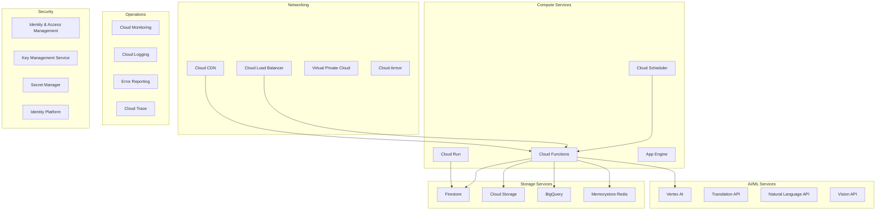

# Google Cloud Services

## Overview

The Uruguay News Analysis System leverages Google Cloud Platform's serverless-first architecture to provide a scalable, cost-effective, and high-performance news analysis platform. This document details the specific Google Cloud services used and their configurations.

## Service Architecture



## Compute Services

### Cloud Functions
**Primary backend service for serverless API endpoints**

#### Configuration
```yaml
# functions.yaml
functions:
  - name: analyze-news
    runtime: python311
    trigger: http
    memory: 512MB
    timeout: 60s
    environment:
      FIRESTORE_PROJECT_ID: uruguay-news-prod
      REDIS_URL: redis://memorystore-instance
      OPENAI_API_KEY: projects/PROJECT_ID/secrets/openai-key
```

#### Use Cases
- **REST API Endpoints**: News analysis, user management
- **Data Processing**: Content extraction, sentiment analysis
- **Webhook Handlers**: External service integrations
- **Scheduled Tasks**: Periodic data collection

#### Scaling Configuration
- **Max Instances**: 1000 concurrent executions
- **Min Instances**: 0 (scales to zero)
- **Memory**: 128MB - 8GB (configurable per function)
- **CPU**: 1 vCPU per instance (automatic allocation)

#### Cost Optimization
- **Free Tier**: 2M invocations/month
- **Pricing**: $0.0000004 per invocation + $0.0000025 per 100ms
- **Estimated Cost**: $10-20/month for 5M invocations

### Cloud Run
**Container-based services for long-running tasks**

#### Configuration
```yaml
# cloudrun.yaml
apiVersion: serving.knative.dev/v1
kind: Service
metadata:
  name: ai-processor
spec:
  template:
    spec:
      containers:
      - image: gcr.io/PROJECT_ID/ai-processor:latest
        resources:
          limits:
            cpu: 2
            memory: 4Gi
        env:
        - name: FIRESTORE_PROJECT_ID
          value: uruguay-news-prod
```

#### Use Cases
- **AI Model Serving**: Complex machine learning inference
- **Batch Processing**: Large-scale data analysis
- **Background Jobs**: Long-running processing tasks
- **Microservices**: Containerized application components

#### Scaling Configuration
- **Max Instances**: 100 concurrent containers
- **Min Instances**: 0 (scales to zero)
- **CPU**: 1-4 vCPU (configurable)
- **Memory**: 128MB - 32GB (configurable)

### Cloud Scheduler
**Managed cron service for scheduled tasks**

#### Configuration
```yaml
# scheduler.yaml
jobs:
  - name: collect-news
    schedule: "0 */6 * * *"  # Every 6 hours
    target:
      httpTarget:
        uri: https://REGION-PROJECT_ID.cloudfunctions.net/collect-news
        httpMethod: POST
    timeZone: America/Montevideo
```

#### Use Cases
- **Data Collection**: Scheduled news scraping
- **Cleanup Tasks**: Database maintenance
- **Report Generation**: Automated analytics
- **Health Checks**: System monitoring

## Storage Services

### Firestore
**Primary NoSQL database for real-time data**

#### Database Structure
```javascript
// Collection: articles
{
  id: "article_123",
  title: "Uruguay Elections 2024",
  content: "Full article content...",
  source: "El País",
  published_at: "2024-01-15T10:00:00Z",
  analysis: {
    sentiment: {
      score: 0.7,
      confidence: 0.85,
      emotions: ["positive", "hopeful"]
    },
    bias: {
      score: 0.3,
      direction: "left",
      confidence: 0.78
    },
    entities: [
      {
        name: "Luis Lacalle Pou",
        type: "PERSON",
        sentiment: 0.6
      }
    ]
  },
  metadata: {
    processed_at: "2024-01-15T10:05:00Z",
    model_version: "v1.2.0"
  }
}
```

#### Indexing Strategy
```javascript
// Composite indexes for efficient queries
indexes = [
  {
    collection: "articles",
    fields: ["source", "published_at", "analysis.sentiment.score"]
  },
  {
    collection: "articles", 
    fields: ["published_at", "analysis.bias.score"]
  }
]
```

#### Security Rules
```javascript
// firestore.rules
rules_version = '2';
service cloud.firestore {
  match /databases/{database}/documents {
    match /articles/{articleId} {
      allow read: if true;  // Public read
      allow write: if request.auth != null && 
                   request.auth.token.admin == true;
    }
    
    match /users/{userId} {
      allow read, write: if request.auth != null && 
                        request.auth.uid == userId;
    }
  }
}
```

#### Performance Optimization
- **Document Size**: Max 1MB per document
- **Batch Operations**: Up to 500 operations per batch
- **Caching**: Redis for frequently accessed data
- **Sharding**: Distributed document keys

#### Cost Structure
- **Free Tier**: 1GB storage, 50K reads, 20K writes daily
- **Pricing**: $0.18 per 100K reads, $0.18 per 100K writes
- **Estimated Cost**: $5-10/month for 1M operations

### Cloud Storage
**Object storage for media files and backups**

#### Bucket Configuration
```yaml
# storage.yaml
buckets:
  - name: uruguay-news-media
    location: us-central1
    storageClass: STANDARD
    lifecycle:
      rules:
        - action: DELETE
          condition:
            age: 365  # Delete after 1 year
        - action: NEARLINE
          condition:
            age: 30   # Move to nearline after 30 days
```

#### Use Cases
- **Media Files**: Images, videos from news articles
- **Backups**: Database exports and archives
- **Static Assets**: Frontend build artifacts
- **ML Models**: Trained model artifacts

#### Security
- **IAM Roles**: Service account access only
- **Encryption**: Google-managed encryption keys
- **Access Control**: Signed URLs for temporary access
- **Audit Logging**: All access tracked

### BigQuery
**Data warehouse for analytics and reporting**

#### Schema Design
```sql
-- Table: article_analytics
CREATE TABLE `uruguay-news.analytics.article_analytics` (
  article_id STRING NOT NULL,
  published_date DATE NOT NULL,
  source STRING NOT NULL,
  sentiment_score FLOAT64,
  bias_score FLOAT64,
  bias_direction STRING,
  entity_count INT64,
  engagement_metrics STRUCT<
    views INT64,
    shares INT64,
    comments INT64
  >,
  created_at TIMESTAMP NOT NULL DEFAULT CURRENT_TIMESTAMP()
)
PARTITION BY published_date
CLUSTER BY source, bias_direction;
```

#### Streaming Ingestion
```python
# BigQuery streaming from Cloud Functions
from google.cloud import bigquery

def stream_to_bigquery(article_data):
    client = bigquery.Client()
    table_id = "uruguay-news.analytics.article_analytics"
    
    rows_to_insert = [{
        "article_id": article_data["id"],
        "published_date": article_data["published_date"],
        "source": article_data["source"],
        "sentiment_score": article_data["analysis"]["sentiment"]["score"],
        "bias_score": article_data["analysis"]["bias"]["score"],
        "bias_direction": article_data["analysis"]["bias"]["direction"],
        "entity_count": len(article_data["analysis"]["entities"])
    }]
    
    errors = client.insert_rows_json(table_id, rows_to_insert)
    return errors
```

#### Cost Optimization
- **Partitioning**: By date for efficient queries
- **Clustering**: By frequently filtered columns
- **Materialized Views**: Pre-computed aggregations
- **Slot Reservations**: Predictable pricing

### Memorystore Redis
**Managed Redis for caching and session management**

#### Instance Configuration
```yaml
# redis.yaml
instance:
  name: uruguay-news-cache
  tier: BASIC
  memory_size_gb: 1
  region: us-central1
  auth_enabled: true
  redis_version: REDIS_7_0
  
  # Network configuration
  authorized_network: projects/PROJECT_ID/global/networks/default
  connect_mode: PRIVATE_SERVICE_ACCESS
```

#### Caching Strategy
```python
# Redis caching patterns
import redis
import json

class NewsCache:
    def __init__(self, redis_url):
        self.redis = redis.from_url(redis_url)
    
    def cache_analysis(self, article_id, analysis, ttl=3600):
        """Cache analysis results for 1 hour"""
        key = f"analysis:{article_id}"
        self.redis.setex(key, ttl, json.dumps(analysis))
    
    def get_cached_analysis(self, article_id):
        """Retrieve cached analysis"""
        key = f"analysis:{article_id}"
        cached = self.redis.get(key)
        return json.loads(cached) if cached else None
    
    def cache_trending(self, trends, ttl=300):
        """Cache trending topics for 5 minutes"""
        self.redis.setex("trending:topics", ttl, json.dumps(trends))
```

#### Use Cases
- **API Response Caching**: Reduce database load
- **Session Management**: User authentication state
- **Rate Limiting**: API quota tracking
- **Real-time Features**: Pub/Sub messaging

#### Cost Structure
- **Basic Tier**: $0.049/hour per GB
- **Standard Tier**: $0.054/hour per GB + replica costs
- **Estimated Cost**: $15-25/month for 1GB basic tier

## AI/ML Services

### Vertex AI
**Unified ML platform for model training and deployment**

#### Model Deployment
```python
# Vertex AI model deployment
from google.cloud import aiplatform

aiplatform.init(
    project="uruguay-news-prod",
    location="us-central1"
)

# Deploy sentiment analysis model
model = aiplatform.Model.upload(
    display_name="sentiment-analyzer-v1",
    artifact_uri="gs://uruguay-news-models/sentiment/v1",
    serving_container_image_uri="us-docker.pkg.dev/vertex-ai/prediction/sklearn-cpu.1-0:latest"
)

endpoint = model.deploy(
    machine_type="n1-standard-2",
    min_replica_count=1,
    max_replica_count=10
)
```

#### Use Cases
- **Custom Model Training**: Fine-tuned sentiment analysis
- **AutoML**: Automated model development
- **Batch Predictions**: Large-scale inference
- **A/B Testing**: Model comparison

### Natural Language API
**Pre-trained NLP models for text analysis**

#### Integration Example
```python
# Natural Language API integration
from google.cloud import language_v1

def analyze_entities(text):
    client = language_v1.LanguageServiceClient()
    
    document = language_v1.Document(
        content=text,
        type_=language_v1.Document.Type.PLAIN_TEXT,
        language="es"  # Spanish
    )
    
    response = client.analyze_entities(
        request={"document": document}
    )
    
    return [
        {
            "name": entity.name,
            "type": entity.type_.name,
            "salience": entity.salience
        }
        for entity in response.entities
    ]
```

## Networking Services

### Cloud Load Balancer
**Global load balancing for high availability**

#### Configuration
```yaml
# loadbalancer.yaml
apiVersion: networking.gke.io/v1
kind: ManagedCertificate
metadata:
  name: uruguay-news-ssl
spec:
  domains:
    - api.uruguaynews.com
    - app.uruguaynews.com
---
apiVersion: networking.k8s.io/v1
kind: Ingress
metadata:
  name: uruguay-news-ingress
  annotations:
    kubernetes.io/ingress.global-static-ip-name: uruguay-news-ip
    networking.gke.io/managed-certificates: uruguay-news-ssl
spec:
  rules:
    - host: api.uruguaynews.com
      http:
        paths:
          - path: /
            pathType: Prefix
            backend:
              service:
                name: api-service
                port:
                  number: 80
```

#### Features
- **Global Anycast**: Single IP address worldwide
- **SSL Termination**: Automatic certificate management
- **Health Checks**: Automatic failover
- **CDN Integration**: Edge caching

### Cloud CDN
**Content delivery network for global performance**

#### Configuration
```yaml
# cdn.yaml
backend_service:
  name: uruguay-news-backend
  backends:
    - group: projects/PROJECT_ID/zones/us-central1-a/instanceGroups/frontend-group
  cdn_policy:
    cache_mode: CACHE_ALL_STATIC
    default_ttl: 3600
    max_ttl: 86400
    cache_key_policy:
      include_host: true
      include_protocol: true
      include_query_string: false
```

#### Cache Strategy
- **Static Assets**: 24 hours TTL
- **API Responses**: 5 minutes TTL
- **Dynamic Content**: No caching
- **Invalidation**: Automatic on deployment

## Operations & Monitoring

### Cloud Monitoring
**Infrastructure and application monitoring**

#### Custom Metrics
```python
# Custom metrics for monitoring
from google.cloud import monitoring_v3

def record_analysis_latency(latency_ms):
    client = monitoring_v3.MetricServiceClient()
    project_name = f"projects/{PROJECT_ID}"
    
    # Create time series
    series = monitoring_v3.TimeSeries()
    series.metric.type = "custom.googleapis.com/news/analysis_latency"
    series.resource.type = "global"
    
    # Add data point
    point = monitoring_v3.Point()
    point.value.double_value = latency_ms
    point.interval.end_time.seconds = int(time.time())
    series.points = [point]
    
    client.create_time_series(
        name=project_name,
        time_series=[series]
    )
```

#### Alerting Policies
```yaml
# alerting.yaml
policies:
  - name: High Error Rate
    conditions:
      - threshold:
          filter: 'resource.type="cloud_function"'
          comparison: COMPARISON_GREATER_THAN
          threshold_value: 0.1
          duration: 300s
    notification_channels:
      - projects/PROJECT_ID/notificationChannels/email-alerts
```

### Cloud Logging
**Centralized log management**

#### Structured Logging
```python
# Structured logging in Cloud Functions
import logging
import json

def log_analysis_result(article_id, result):
    log_entry = {
        "severity": "INFO",
        "message": "Analysis completed",
        "article_id": article_id,
        "sentiment_score": result["sentiment"]["score"],
        "bias_score": result["bias"]["score"],
        "processing_time_ms": result["processing_time"]
    }
    
    logging.info(json.dumps(log_entry))
```

#### Log Retention
- **Default**: 30 days
- **Extended**: 3650 days (configurable)
- **Export**: BigQuery for long-term analysis
- **Alerting**: Real-time log-based alerts

## Security Services

### Identity & Access Management (IAM)
**Fine-grained access control**

#### Service Account Configuration
```yaml
# iam.yaml
service_accounts:
  - name: news-collector
    roles:
      - roles/firestore.user
      - roles/storage.objectCreator
      - roles/bigquery.dataEditor
  
  - name: api-service
    roles:
      - roles/firestore.user
      - roles/redis.editor
      - roles/aiplatform.user
```

#### Custom Roles
```yaml
# custom_roles.yaml
roles:
  - name: news.analyst
    permissions:
      - firestore.documents.read
      - firestore.documents.write
      - bigquery.jobs.create
      - bigquery.tables.getData
```

### Secret Manager
**Secure storage for sensitive data**

#### Secret Configuration
```python
# Secret Manager integration
from google.cloud import secretmanager

def get_secret(secret_name):
    client = secretmanager.SecretManagerServiceClient()
    name = f"projects/{PROJECT_ID}/secrets/{secret_name}/versions/latest"
    
    response = client.access_secret_version(request={"name": name})
    return response.payload.data.decode("UTF-8")

# Usage
openai_key = get_secret("openai-api-key")
redis_url = get_secret("redis-connection-url")
```

#### Best Practices
- **Rotation**: Automatic key rotation
- **Versioning**: Multiple secret versions
- **Access Control**: Least privilege principle
- **Audit Logging**: All access tracked

## Cost Management

### Resource Optimization
```yaml
# cost_optimization.yaml
strategies:
  - name: Function Memory Optimization
    description: Right-size memory allocation
    savings: 20-30%
  
  - name: Firestore Query Optimization
    description: Efficient indexing and querying
    savings: 40-50%
  
  - name: BigQuery Slot Reservations
    description: Predictable query costs
    savings: 30-40%
  
  - name: Redis Instance Sizing
    description: Match memory to usage
    savings: 25-35%
```

### Billing Alerts
```yaml
# billing_alerts.yaml
budgets:
  - name: Monthly Cloud Budget
    amount: 100  # USD
    threshold_rules:
      - threshold_percent: 0.5
        spend_basis: CURRENT_SPEND
      - threshold_percent: 0.8
        spend_basis: FORECASTED_SPEND
```

## Deployment & CI/CD

### Cloud Build
**Automated build and deployment pipeline**

#### Build Configuration
```yaml
# cloudbuild.yaml
steps:
  # Build Docker image
  - name: 'gcr.io/cloud-builders/docker'
    args: ['build', '-t', 'gcr.io/$PROJECT_ID/api:$BUILD_ID', '.']
  
  # Push to registry
  - name: 'gcr.io/cloud-builders/docker'
    args: ['push', 'gcr.io/$PROJECT_ID/api:$BUILD_ID']
  
  # Deploy to Cloud Run
  - name: 'gcr.io/cloud-builders/gcloud'
    args:
      - 'run'
      - 'deploy'
      - 'api-service'
      - '--image'
      - 'gcr.io/$PROJECT_ID/api:$BUILD_ID'
      - '--region'
      - 'us-central1'
      - '--platform'
      - 'managed'
```

#### Deployment Strategy
- **Blue-Green**: Zero-downtime deployments
- **Canary**: Gradual traffic shifting
- **Rollback**: Automatic on failure
- **Testing**: Automated integration tests

## Next Steps

1. **Set up** Google Cloud project and enable APIs
2. **Configure** IAM roles and service accounts
3. **Deploy** infrastructure using Terraform
4. **Monitor** resource usage and costs
5. **Optimize** performance and scaling

For more information, see:
- [AI Pipeline Documentation](ai-pipeline.md)
- [Data Flow Architecture](data-flow.md)
- [Development Setup](../development/setup.md)
- [Deployment Guide](../development/deployment.md) 