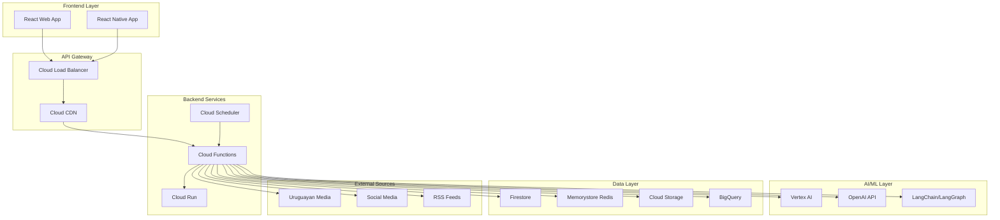
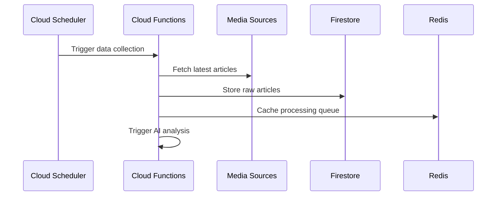
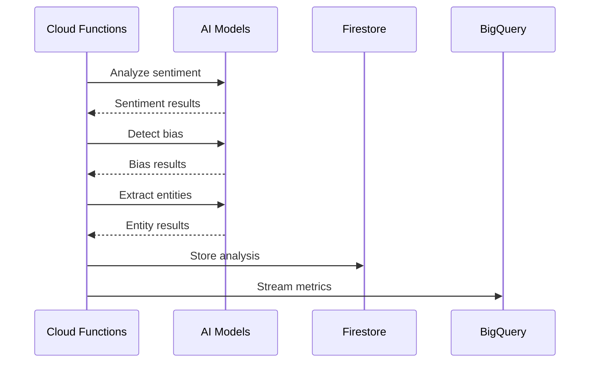
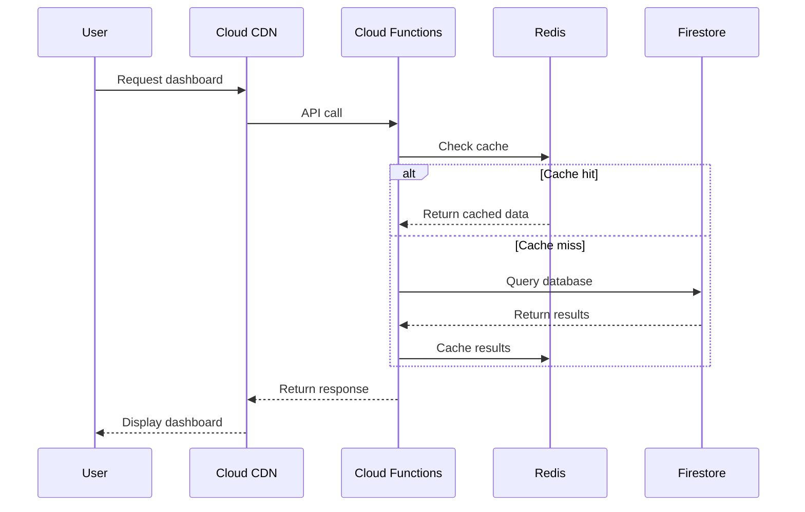

# System Architecture Overview

## Introduction

The Uruguay News Analysis System is a modern, cloud-native application designed to analyze news content from Uruguayan media sources using advanced AI techniques. The system follows a **serverless-first architecture** built on Google Cloud Platform, emphasizing cost-effectiveness, scalability, and high performance.

## High-Level Architecture

## Core Principles

### 1. **Serverless-First Architecture**
- **Zero Infrastructure Management**: No servers to maintain or scale
- **Pay-per-Use**: Only pay for actual compute time and resources used
- **Automatic Scaling**: Handles traffic spikes from 0 to millions of requests
- **High Availability**: 99.95% uptime SLA with automatic failover

### 2. **AI-Powered Analysis**
- **Multi-Model Pipeline**: Combines multiple AI models for comprehensive analysis
- **Real-time Processing**: <200ms response times for sentiment analysis
- **Bias Detection**: 84%+ accuracy in detecting political bias
- **Cultural Context**: Specifically trained for Uruguayan Spanish and cultural nuances

### 3. **Cost-Effective Design**
- **Free Tier Maximization**: Utilizes Google Cloud free tier limits
- **Efficient Caching**: Redis for expensive AI operations
- **Optimized Queries**: Firestore indexing and query optimization
- **Resource Monitoring**: Automated cost tracking and alerts

## System Components

### Frontend Layer

#### Web Application
- **Technology**: React 18 + TypeScript
- **UI Framework**: Tailwind CSS + Shadcn/ui
- **State Management**: Zustand for global state
- **Data Fetching**: React Query for server state
- **Deployment**: GitHub Pages (static hosting)

#### Mobile Application
- **Technology**: React Native + Expo
- **Cross-Platform**: iOS and Android support
- **Native Features**: Push notifications, offline support
- **API Integration**: Same REST API as web app

### API Gateway Layer

#### Cloud Load Balancer
- **Global Distribution**: Multi-region traffic routing
- **SSL Termination**: Automatic HTTPS with managed certificates
- **Rate Limiting**: Protection against DDoS attacks
- **Health Checks**: Automatic failover for unhealthy backends

#### Cloud CDN
- **Global Caching**: Edge locations worldwide
- **Asset Optimization**: Automatic compression and optimization
- **Cache Invalidation**: Automatic cache updates
- **Performance**: <100ms response times globally

### Backend Services

#### Cloud Functions
- **Event-Driven**: Triggers on HTTP requests, Pub/Sub messages
- **Language**: Python 3.11 with FastAPI framework
- **Scaling**: 0 to 1000+ concurrent executions
- **Use Cases**: API endpoints, data processing, scheduled tasks

#### Cloud Run
- **Containerized Services**: Docker-based deployments
- **Long-Running Tasks**: Complex AI processing workflows
- **Custom Runtimes**: Support for any language or framework
- **Auto-scaling**: Based on CPU, memory, or request metrics

#### Cloud Scheduler
- **Cron Jobs**: Scheduled data collection and analysis
- **Reliability**: Guaranteed execution with retry logic
- **Monitoring**: Detailed logs and metrics
- **Integration**: Triggers Cloud Functions and Pub/Sub

### AI/ML Layer

#### Vertex AI (Future)
- **Model Training**: Custom model development
- **AutoML**: Automated model selection and tuning
- **Prediction**: Real-time and batch predictions
- **MLOps**: Model versioning and monitoring

#### OpenAI Integration (Current)
- **GPT Models**: Text analysis and generation
- **Embedding Models**: Semantic similarity and search
- **API Management**: Rate limiting and cost optimization
- **Fallback Systems**: Graceful degradation

#### LangChain/LangGraph
- **Multi-Agent Workflows**: Complex AI pipelines
- **Tool Integration**: External API connections
- **Memory Management**: Conversation context
- **Observability**: Detailed execution traces

### Data Layer

#### Firestore
- **Document Database**: NoSQL with real-time updates
- **Scaling**: Automatic sharding and replication
- **Offline Support**: Client-side caching
- **Security**: Fine-grained access control

#### Memorystore Redis
- **Caching**: High-performance in-memory storage
- **Session Management**: User authentication state
- **Rate Limiting**: API quota management
- **Pub/Sub**: Real-time notifications

#### Cloud Storage
- **Object Storage**: Media files and backups
- **CDN Integration**: Global content delivery
- **Lifecycle Management**: Automatic archiving
- **Security**: Encryption at rest and in transit

#### BigQuery
- **Data Warehouse**: Analytics and reporting
- **Real-time Analytics**: Streaming data ingestion
- **ML Integration**: BigQuery ML for insights
- **Cost Optimization**: Partitioned tables and clustering

## Data Flow Architecture

### 1. **Data Ingestion**

### 2. **AI Processing Pipeline**

### 3. **User Interaction**

## Security Architecture

### Authentication & Authorization
- **Identity Platform**: Google Cloud Identity for user management
- **JWT Tokens**: Secure token-based authentication
- **Role-Based Access**: Granular permissions system
- **API Keys**: Secure external API access

### Data Protection
- **Encryption**: At rest and in transit
- **GDPR Compliance**: Data privacy controls
- **Audit Logging**: All access tracked
- **Backup Strategy**: Automated backups and recovery

### Network Security
- **VPC**: Virtual private cloud isolation
- **Cloud Armor**: DDoS protection and WAF
- **SSL/TLS**: End-to-end encryption
- **Private Endpoints**: Secure service communication

## Performance & Monitoring

### Key Metrics
- **Response Time**: <200ms for API endpoints
- **Availability**: 99.95% uptime SLA
- **Accuracy**: 84%+ for sentiment analysis
- **Cost**: $50-100/month for full operation

### Monitoring Stack
- **Cloud Monitoring**: Infrastructure metrics
- **Cloud Logging**: Centralized log management
- **Error Reporting**: Automatic error detection
- **APM**: Application performance monitoring

### Alerting
- **Performance Alerts**: Latency and error rate
- **Cost Alerts**: Budget threshold notifications
- **Security Alerts**: Unusual access patterns
- **Uptime Monitoring**: Service availability

## Deployment Strategy

### Environments
- **Development**: Local with emulators
- **Staging**: Reduced-scale cloud deployment
- **Production**: Full-scale cloud deployment

### CI/CD Pipeline
- **GitHub Actions**: Automated testing and deployment
- **Cloud Build**: Container image building
- **Cloud Deploy**: Progressive rollouts
- **Rollback**: Automatic rollback on failures

### Blue-Green Deployment
- **Zero Downtime**: Seamless updates
- **Traffic Splitting**: Gradual rollout
- **Health Checks**: Automated verification
- **Monitoring**: Real-time deployment tracking

## Future Enhancements

### Planned Features
- **Mobile App**: React Native implementation
- **Real-time Notifications**: WebSocket integration
- **Advanced Analytics**: Machine learning insights
- **Multi-language Support**: Expand beyond Spanish

### Scalability Roadmap
- **Global Deployment**: Multi-region architecture
- **Edge Computing**: Closer to users
- **Microservices**: Service decomposition
- **Event-Driven**: Pub/Sub architecture

## Cost Optimization

### Current Costs (Monthly)
- **Cloud Functions**: $10-20 (2M invocations)
- **Firestore**: $5-10 (1GB storage, 1M operations)
- **Memorystore**: $15-25 (Basic tier)
- **BigQuery**: $5-10 (1TB queries, 10GB storage)
- **Total**: $35-65/month

### Optimization Strategies
- **Efficient Queries**: Minimize database operations
- **Caching**: Reduce redundant computations
- **Resource Monitoring**: Proactive cost management
- **Free Tier Usage**: Maximize free quotas

## Next Steps

1. **Review** this architecture overview
2. **Explore** detailed component documentation
3. **Set up** development environment
4. **Deploy** your first function
5. **Monitor** system performance

For more detailed information, see:
- [Google Cloud Services](google-cloud.md)
- [AI Pipeline](ai-pipeline.md)
- [Data Flow](data-flow.md)
- [Development Setup](../development/setup.md) 