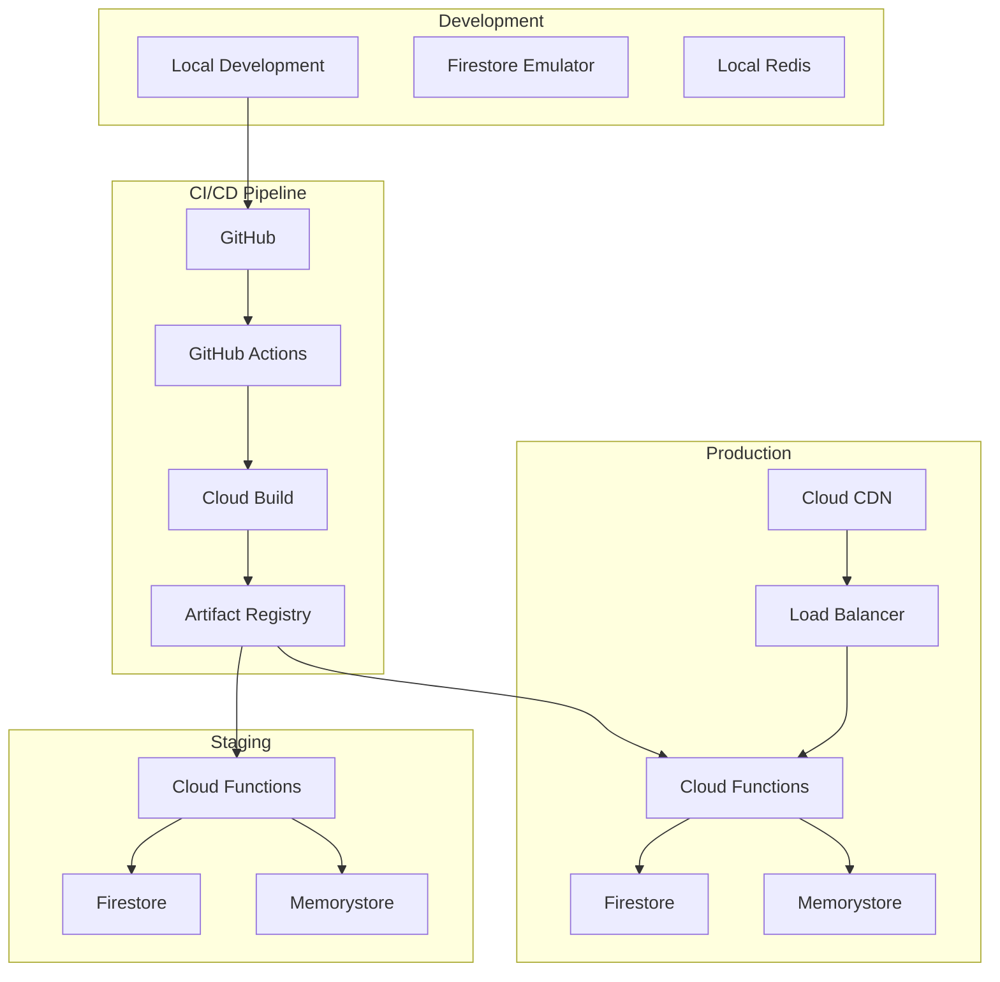

# Deployment Guide

## Overview

This guide covers the complete deployment process for the Uruguay News Analysis System, including local development, staging, and production environments. The system uses a serverless-first architecture on Google Cloud Platform with automated CI/CD pipelines.

## Deployment Architecture



## Environment Setup

### Local Development Environment

#### Prerequisites
```bash
# Install required tools
curl -LsSf https://astral.sh/uv/install.sh | sh  # UV package manager
npm install -g @google-cloud/functions-framework  # Functions framework
npm install -g firebase-tools  # Firebase CLI

# Install Google Cloud SDK
curl https://sdk.cloud.google.com | bash
gcloud auth login
gcloud config set project uruguay-news-dev
```

#### Environment Configuration
```bash
# .env.local
DATABASE_URL=firestore://localhost:8080/test-database
REDIS_URL=redis://localhost:6379
FIRESTORE_EMULATOR_HOST=localhost:8080
PUBSUB_EMULATOR_HOST=localhost:8085

# AI Services
OPENAI_API_KEY=your-openai-api-key
GOOGLE_AI_KEY=your-google-ai-key

# Security
SECRET_KEY=your-local-secret-key
JWT_SECRET=your-jwt-secret

# Development settings
DEBUG=true
LOG_LEVEL=DEBUG
ENVIRONMENT=local
```

#### Local Services Setup
```bash
# Start Firestore emulator
firebase emulators:start --only firestore &

# Start Redis locally
redis-server --daemonize yes

# Start backend services
cd backend
uv run python -m main

# Start frontend development server
cd frontend/web
npm run dev
```

### Staging Environment

#### Google Cloud Project Setup
```bash
# Create staging project
gcloud projects create uruguay-news-staging
gcloud config set project uruguay-news-staging

# Enable required APIs
gcloud services enable cloudfunctions.googleapis.com
gcloud services enable firestore.googleapis.com
gcloud services enable redis.googleapis.com
gcloud services enable cloudbuild.googleapis.com
gcloud services enable secretmanager.googleapis.com
gcloud services enable monitoring.googleapis.com
```

#### Infrastructure as Code
```yaml
# terraform/staging/main.tf
terraform {
  required_providers {
    google = {
      source  = "hashicorp/google"
      version = "~> 4.0"
    }
  }
}

provider "google" {
  project = "uruguay-news-staging"
  region  = "us-central1"
}

# Firestore database
resource "google_firestore_database" "database" {
  name     = "(default)"
  location_id = "us-central1"
  type     = "FIRESTORE_NATIVE"
}

# Redis instance
resource "google_redis_instance" "cache" {
  name           = "uruguay-news-cache"
  memory_size_gb = 1
  tier           = "BASIC"
  region         = "us-central1"
}

# Cloud Functions
resource "google_cloudfunctions_function" "analyze_news" {
  name        = "analyze-news"
  description = "Analyze news articles"
  runtime     = "python311"
  
  available_memory_mb   = 512
  timeout              = 60
  entry_point          = "main"
  
  source_archive_bucket = google_storage_bucket.functions.name
  source_archive_object = google_storage_bucket_object.function_source.name
  
  trigger {
    https_trigger {}
  }
  
  environment_variables = {
    FIRESTORE_PROJECT_ID = "uruguay-news-staging"
    REDIS_URL           = "redis://${google_redis_instance.cache.host}:6379"
    ENVIRONMENT         = "staging"
  }
}

# Storage bucket for function code
resource "google_storage_bucket" "functions" {
  name     = "uruguay-news-functions-staging"
  location = "us-central1"
}
```

#### Staging Deployment Script
```bash
#!/bin/bash
# deploy-staging.sh

set -e

echo "🚀 Deploying to staging environment..."

# Set project
gcloud config set project uruguay-news-staging

# Deploy infrastructure
echo "📦 Deploying infrastructure..."
cd terraform/staging
terraform init
terraform plan
terraform apply -auto-approve

# Build and deploy functions
echo "🔨 Building and deploying functions..."
cd ../../backend

# Package function
zip -r function.zip . -x "tests/*" "*.pyc" "__pycache__/*"

# Upload to storage
gsutil cp function.zip gs://uruguay-news-functions-staging/

# Deploy function
gcloud functions deploy analyze-news \
  --source gs://uruguay-news-functions-staging/function.zip \
  --entry-point main \
  --runtime python311 \
  --trigger http \
  --memory 512MB \
  --timeout 60s \
  --set-env-vars ENVIRONMENT=staging

# Deploy frontend
echo "🌐 Deploying frontend..."
cd ../frontend/web
npm run build
gsutil -m rsync -r -d dist/ gs://uruguay-news-web-staging/

echo "✅ Staging deployment complete!"
```

### Production Environment

#### Production Infrastructure
```yaml
# terraform/production/main.tf
terraform {
  required_providers {
    google = {
      source  = "hashicorp/google"
      version = "~> 4.0"
    }
  }
}

provider "google" {
  project = "uruguay-news-prod"
  region  = "us-central1"
}

# High-availability Firestore
resource "google_firestore_database" "database" {
  name     = "(default)"
  location_id = "nam5"  # Multi-region
  type     = "FIRESTORE_NATIVE"
}

# Redis with replication
resource "google_redis_instance" "cache" {
  name           = "uruguay-news-cache"
  memory_size_gb = 4
  tier           = "STANDARD_HA"
  region         = "us-central1"
  
  replica_count = 1
  read_replicas_mode = "READ_REPLICAS_ENABLED"
}

# Cloud Functions with scaling
resource "google_cloudfunctions_function" "analyze_news" {
  name        = "analyze-news"
  description = "Analyze news articles"
  runtime     = "python311"
  
  available_memory_mb   = 1024
  timeout              = 120
  entry_point          = "main"
  
  max_instances = 1000
  min_instances = 5
  
  source_archive_bucket = google_storage_bucket.functions.name
  source_archive_object = google_storage_bucket_object.function_source.name
  
  trigger {
    https_trigger {}
  }
  
  environment_variables = {
    FIRESTORE_PROJECT_ID = "uruguay-news-prod"
    REDIS_URL           = "redis://${google_redis_instance.cache.host}:6379"
    ENVIRONMENT         = "production"
  }
}

# Load balancer
resource "google_compute_global_address" "default" {
  name = "uruguay-news-ip"
}

resource "google_compute_url_map" "default" {
  name            = "uruguay-news-urlmap"
  default_service = google_compute_backend_service.default.id
}

resource "google_compute_backend_service" "default" {
  name     = "uruguay-news-backend"
  protocol = "HTTP"
  
  backend {
    group = google_compute_instance_group_manager.default.instance_group
  }
}

# CDN
resource "google_compute_global_forwarding_rule" "default" {
  name       = "uruguay-news-forwarding-rule"
  target     = google_compute_target_https_proxy.default.id
  port_range = "443"
  ip_address = google_compute_global_address.default.address
}

resource "google_compute_target_https_proxy" "default" {
  name             = "uruguay-news-https-proxy"
  url_map          = google_compute_url_map.default.id
  ssl_certificates = [google_compute_ssl_certificate.default.id]
}

resource "google_compute_ssl_certificate" "default" {
  name = "uruguay-news-ssl-cert"
  
  managed {
    domains = ["api.uruguaynews.com", "app.uruguaynews.com"]
  }
}
```

## CI/CD Pipeline

### GitHub Actions Workflow

#### Main Pipeline
```yaml
# .github/workflows/deploy.yml
name: Deploy to Production

on:
  push:
    branches: [main]
  workflow_dispatch:

env:
  PROJECT_ID: uruguay-news-prod
  REGION: us-central1
  
jobs:
  test:
    runs-on: ubuntu-latest
    
    steps:
      - name: Checkout code
        uses: actions/checkout@v3
      
      - name: Set up Python
        uses: actions/setup-python@v4
        with:
          python-version: '3.11'
      
      - name: Install UV
        run: curl -LsSf https://astral.sh/uv/install.sh | sh
      
      - name: Install dependencies
        run: uv sync
      
      - name: Run tests
        run: |
          uv run pytest tests/unit/ -v --cov=src --cov-report=xml
          uv run pytest tests/integration/ -v
      
      - name: Upload coverage
        uses: codecov/codecov-action@v3
        with:
          file: ./coverage.xml
  
  build:
    needs: test
    runs-on: ubuntu-latest
    
    steps:
      - name: Checkout code
        uses: actions/checkout@v3
      
      - name: Set up Google Cloud SDK
        uses: google-github-actions/setup-gcloud@v1
        with:
          project_id: ${{ env.PROJECT_ID }}
          service_account_key: ${{ secrets.GCP_SA_KEY }}
          export_default_credentials: true
      
      - name: Configure Docker
        run: gcloud auth configure-docker
      
      - name: Build backend image
        run: |
          cd backend
          docker build -t gcr.io/${{ env.PROJECT_ID }}/analyze-news:${{ github.sha }} .
          docker push gcr.io/${{ env.PROJECT_ID }}/analyze-news:${{ github.sha }}
      
      - name: Build frontend
        run: |
          cd frontend/web
          npm ci
          npm run build
          gsutil -m rsync -r -d dist/ gs://uruguay-news-web-prod/
  
  deploy-infrastructure:
    needs: build
    runs-on: ubuntu-latest
    
    steps:
      - name: Checkout code
        uses: actions/checkout@v3
      
      - name: Set up Terraform
        uses: hashicorp/setup-terraform@v2
        with:
          terraform_version: 1.5.0
      
      - name: Deploy infrastructure
        run: |
          cd terraform/production
          terraform init -backend-config="bucket=uruguay-news-terraform-state"
          terraform plan -var="image_tag=${{ github.sha }}"
          terraform apply -auto-approve -var="image_tag=${{ github.sha }}"
        env:
          GOOGLE_CREDENTIALS: ${{ secrets.GCP_SA_KEY }}
  
  deploy-functions:
    needs: [build, deploy-infrastructure]
    runs-on: ubuntu-latest
    
    steps:
      - name: Checkout code
        uses: actions/checkout@v3
      
      - name: Set up Google Cloud SDK
        uses: google-github-actions/setup-gcloud@v1
        with:
          project_id: ${{ env.PROJECT_ID }}
          service_account_key: ${{ secrets.GCP_SA_KEY }}
          export_default_credentials: true
      
      - name: Deploy Cloud Functions
        run: |
          cd backend
          gcloud functions deploy analyze-news \
            --source . \
            --entry-point main \
            --runtime python311 \
            --trigger http \
            --memory 1024MB \
            --timeout 120s \
            --max-instances 1000 \
            --min-instances 5 \
            --set-env-vars ENVIRONMENT=production
  
  post-deployment:
    needs: [deploy-functions]
    runs-on: ubuntu-latest
    
    steps:
      - name: Run smoke tests
        run: |
          # Test API endpoint
          curl -f https://api.uruguaynews.com/health || exit 1
          
          # Test analysis endpoint
          curl -f -X POST https://api.uruguaynews.com/api/articles/analyze \
            -H "Content-Type: application/json" \
            -d '{"title":"Test","content":"Test content","source":"Test"}' || exit 1
      
      - name: Update monitoring
        run: |
          # Update deployment metrics
          gcloud logging write deployment-log \
            '{"severity":"INFO","message":"Deployment completed","version":"'${{ github.sha }}'"}'
      
      - name: Notify team
        uses: 8398a7/action-slack@v3
        with:
          status: ${{ job.status }}
          text: "Deployment to production completed successfully! 🚀"
        env:
          SLACK_WEBHOOK_URL: ${{ secrets.SLACK_WEBHOOK }}
```

#### Staging Pipeline
```yaml
# .github/workflows/staging.yml
name: Deploy to Staging

on:
  push:
    branches: [develop]
  pull_request:
    branches: [main]

env:
  PROJECT_ID: uruguay-news-staging
  REGION: us-central1

jobs:
  test-and-deploy:
    runs-on: ubuntu-latest
    
    steps:
      - name: Checkout code
        uses: actions/checkout@v3
      
      - name: Set up Python
        uses: actions/setup-python@v4
        with:
          python-version: '3.11'
      
      - name: Install UV
        run: curl -LsSf https://astral.sh/uv/install.sh | sh
      
      - name: Install dependencies
        run: uv sync
      
      - name: Run tests
        run: |
          uv run pytest tests/unit/ -v
          uv run pytest tests/integration/ -v
      
      - name: Set up Google Cloud SDK
        uses: google-github-actions/setup-gcloud@v1
        with:
          project_id: ${{ env.PROJECT_ID }}
          service_account_key: ${{ secrets.GCP_SA_KEY_STAGING }}
          export_default_credentials: true
      
      - name: Deploy to staging
        run: |
          cd backend
          gcloud functions deploy analyze-news \
            --source . \
            --entry-point main \
            --runtime python311 \
            --trigger http \
            --memory 512MB \
            --timeout 60s \
            --set-env-vars ENVIRONMENT=staging
      
      - name: Run E2E tests
        run: |
          cd frontend/web
          npm ci
          npm run test:e2e:staging
```

### Deployment Scripts

#### Automated Deployment
```bash
#!/bin/bash
# deploy.sh - Main deployment script

set -e

ENVIRONMENT=${1:-staging}
VERSION=${2:-latest}

echo "🚀 Starting deployment to $ENVIRONMENT..."

# Validate environment
if [[ "$ENVIRONMENT" != "staging" && "$ENVIRONMENT" != "production" ]]; then
    echo "❌ Invalid environment. Use 'staging' or 'production'"
    exit 1
fi

# Set project
case $ENVIRONMENT in
    staging)
        PROJECT_ID="uruguay-news-staging"
        ;;
    production)
        PROJECT_ID="uruguay-news-prod"
        ;;
esac

gcloud config set project $PROJECT_ID

# Pre-deployment checks
echo "🔍 Running pre-deployment checks..."
./scripts/pre-deployment-check.sh $ENVIRONMENT

# Deploy infrastructure
echo "📦 Deploying infrastructure..."
cd terraform/$ENVIRONMENT
terraform init
terraform plan -var="version=$VERSION"
terraform apply -auto-approve -var="version=$VERSION"

# Deploy backend
echo "🔧 Deploying backend services..."
cd ../../backend
./scripts/deploy-backend.sh $ENVIRONMENT $VERSION

# Deploy frontend
echo "🌐 Deploying frontend..."
cd ../frontend/web
./scripts/deploy-frontend.sh $ENVIRONMENT $VERSION

# Post-deployment checks
echo "✅ Running post-deployment checks..."
./scripts/post-deployment-check.sh $ENVIRONMENT

echo "🎉 Deployment to $ENVIRONMENT completed successfully!"
```

#### Backend Deployment
```bash
#!/bin/bash
# scripts/deploy-backend.sh

ENVIRONMENT=$1
VERSION=$2

echo "Deploying backend to $ENVIRONMENT..."

# Build function package
echo "📦 Building function package..."
uv export --format requirements-txt > requirements.txt
zip -r function-$VERSION.zip . -x "tests/*" "*.pyc" "__pycache__/*" ".venv/*"

# Upload to storage
echo "📤 Uploading function package..."
gsutil cp function-$VERSION.zip gs://uruguay-news-functions-$ENVIRONMENT/

# Deploy function
echo "🚀 Deploying Cloud Function..."
gcloud functions deploy analyze-news \
    --source gs://uruguay-news-functions-$ENVIRONMENT/function-$VERSION.zip \
    --entry-point main \
    --runtime python311 \
    --trigger http \
    --memory 1024MB \
    --timeout 120s \
    --set-env-vars ENVIRONMENT=$ENVIRONMENT,VERSION=$VERSION

# Update function configuration
echo "⚙️  Updating function configuration..."
gcloud functions update analyze-news \
    --update-env-vars DEPLOYMENT_TIME=$(date -u +"%Y-%m-%dT%H:%M:%SZ")

echo "✅ Backend deployment completed!"
```

#### Frontend Deployment
```bash
#!/bin/bash
# scripts/deploy-frontend.sh

ENVIRONMENT=$1
VERSION=$2

echo "Deploying frontend to $ENVIRONMENT..."

# Install dependencies
echo "📦 Installing dependencies..."
npm ci

# Build for environment
echo "🔨 Building frontend..."
case $ENVIRONMENT in
    staging)
        npm run build:staging
        BUCKET="uruguay-news-web-staging"
        ;;
    production)
        npm run build:production
        BUCKET="uruguay-news-web-prod"
        ;;
esac

# Deploy to bucket
echo "📤 Deploying to Cloud Storage..."
gsutil -m rsync -r -d dist/ gs://$BUCKET/

# Set cache headers
echo "⚡ Setting cache headers..."
gsutil -m setmeta -h "Cache-Control:public, max-age=31536000" gs://$BUCKET/static/**
gsutil -m setmeta -h "Cache-Control:public, max-age=300" gs://$BUCKET/index.html

# Invalidate CDN cache
echo "🔄 Invalidating CDN cache..."
gcloud compute url-maps invalidate-cdn-cache uruguay-news-urlmap --path "/*"

echo "✅ Frontend deployment completed!"
```

## Monitoring and Observability

### Deployment Monitoring
```python
# scripts/deployment_monitor.py
import requests
import time
import sys
from google.cloud import monitoring_v3
from google.cloud import logging as cloud_logging

class DeploymentMonitor:
    def __init__(self, environment: str, version: str):
        self.environment = environment
        self.version = version
        self.monitoring_client = monitoring_v3.MetricServiceClient()
        self.logging_client = cloud_logging.Client()
        
        # Set up project ID based on environment
        self.project_id = f"uruguay-news-{environment}"
    
    def run_health_checks(self) -> bool:
        """Run comprehensive health checks"""
        
        checks = [
            self.check_api_health,
            self.check_analysis_endpoint,
            self.check_database_connection,
            self.check_redis_connection,
            self.check_external_services
        ]
        
        all_passed = True
        for check in checks:
            try:
                if not check():
                    all_passed = False
                    print(f"❌ {check.__name__} failed")
                else:
                    print(f"✅ {check.__name__} passed")
            except Exception as e:
                print(f"❌ {check.__name__} failed with error: {e}")
                all_passed = False
        
        return all_passed
    
    def check_api_health(self) -> bool:
        """Check API health endpoint"""
        url = f"https://api.uruguaynews.com/health"
        if self.environment == "staging":
            url = f"https://api-staging.uruguaynews.com/health"
        
        response = requests.get(url, timeout=10)
        return response.status_code == 200
    
    def check_analysis_endpoint(self) -> bool:
        """Check analysis endpoint functionality"""
        url = f"https://api.uruguaynews.com/api/articles/analyze"
        if self.environment == "staging":
            url = f"https://api-staging.uruguaynews.com/api/articles/analyze"
        
        test_data = {
            "title": "Test Article",
            "content": "This is a test article for deployment verification.",
            "source": "Test Source",
            "url": "https://test.com/article"
        }
        
        response = requests.post(url, json=test_data, timeout=30)
        if response.status_code == 200:
            result = response.json()
            return "analysis" in result and "sentiment" in result["analysis"]
        
        return False
    
    def check_database_connection(self) -> bool:
        """Check database connectivity"""
        # This would be implemented based on your database setup
        # For now, we'll use a simple API call that touches the database
        return True
    
    def check_redis_connection(self) -> bool:
        """Check Redis connectivity"""
        # This would be implemented based on your Redis setup
        return True
    
    def check_external_services(self) -> bool:
        """Check external service connections"""
        # Check OpenAI API connectivity
        try:
            # This would make a test call to OpenAI API
            return True
        except Exception:
            return False
    
    def record_deployment_metrics(self, success: bool, duration: float):
        """Record deployment metrics"""
        
        # Record deployment success/failure
        self.send_metric(
            "deployment.success",
            1 if success else 0,
            {"environment": self.environment, "version": self.version}
        )
        
        # Record deployment duration
        self.send_metric(
            "deployment.duration",
            duration,
            {"environment": self.environment, "version": self.version}
        )
    
    def send_metric(self, metric_name: str, value: float, labels: dict):
        """Send custom metric to Google Cloud Monitoring"""
        
        series = monitoring_v3.TimeSeries()
        series.metric.type = f"custom.googleapis.com/uruguay_news/{metric_name}"
        series.resource.type = "global"
        
        # Add labels
        for key, val in labels.items():
            series.metric.labels[key] = str(val)
        
        # Add data point
        point = monitoring_v3.Point()
        point.value.double_value = value
        point.interval.end_time.seconds = int(time.time())
        series.points = [point]
        
        project_name = f"projects/{self.project_id}"
        self.monitoring_client.create_time_series(
            name=project_name,
            time_series=[series]
        )

if __name__ == "__main__":
    environment = sys.argv[1] if len(sys.argv) > 1 else "staging"
    version = sys.argv[2] if len(sys.argv) > 2 else "latest"
    
    monitor = DeploymentMonitor(environment, version)
    
    start_time = time.time()
    success = monitor.run_health_checks()
    duration = time.time() - start_time
    
    monitor.record_deployment_metrics(success, duration)
    
    if success:
        print(f"✅ All health checks passed for {environment} deployment!")
        sys.exit(0)
    else:
        print(f"❌ Some health checks failed for {environment} deployment!")
        sys.exit(1)
```

### Rollback Procedures
```bash
#!/bin/bash
# scripts/rollback.sh

set -e

ENVIRONMENT=$1
PREVIOUS_VERSION=$2

if [[ -z "$ENVIRONMENT" || -z "$PREVIOUS_VERSION" ]]; then
    echo "Usage: $0 <environment> <previous_version>"
    exit 1
fi

echo "🔄 Rolling back $ENVIRONMENT to version $PREVIOUS_VERSION..."

# Set project
case $ENVIRONMENT in
    staging)
        PROJECT_ID="uruguay-news-staging"
        ;;
    production)
        PROJECT_ID="uruguay-news-prod"
        ;;
    *)
        echo "❌ Invalid environment"
        exit 1
        ;;
esac

gcloud config set project $PROJECT_ID

# Rollback Cloud Functions
echo "🔄 Rolling back Cloud Functions..."
gcloud functions deploy analyze-news \
    --source gs://uruguay-news-functions-$ENVIRONMENT/function-$PREVIOUS_VERSION.zip \
    --entry-point main \
    --runtime python311 \
    --trigger http \
    --memory 1024MB \
    --timeout 120s \
    --set-env-vars ENVIRONMENT=$ENVIRONMENT,VERSION=$PREVIOUS_VERSION

# Rollback frontend if needed
echo "🔄 Rolling back frontend..."
gsutil -m rsync -r -d gs://uruguay-news-web-$ENVIRONMENT-backup/$PREVIOUS_VERSION/ gs://uruguay-news-web-$ENVIRONMENT/

# Invalidate CDN cache
echo "🔄 Invalidating CDN cache..."
gcloud compute url-maps invalidate-cdn-cache uruguay-news-urlmap --path "/*"

# Verify rollback
echo "✅ Verifying rollback..."
python scripts/deployment_monitor.py $ENVIRONMENT $PREVIOUS_VERSION

echo "✅ Rollback completed successfully!"
```

## Security Considerations

### Secrets Management
```bash
# Store secrets in Google Secret Manager
gcloud secrets create openai-api-key --data-file=openai-key.txt
gcloud secrets create jwt-secret --data-file=jwt-secret.txt
gcloud secrets create database-password --data-file=db-password.txt

# Grant access to Cloud Functions
gcloud secrets add-iam-policy-binding openai-api-key \
    --member="serviceAccount:uruguay-news-functions@uruguay-news-prod.iam.gserviceaccount.com" \
    --role="roles/secretmanager.secretAccessor"
```

### IAM Configuration
```yaml
# Service account for deployment
resource "google_service_account" "deploy" {
  account_id   = "deployment-sa"
  display_name = "Deployment Service Account"
}

# Minimal permissions for deployment
resource "google_project_iam_binding" "deploy_permissions" {
  project = var.project_id
  role    = "roles/cloudfunctions.developer"
  
  members = [
    "serviceAccount:${google_service_account.deploy.email}",
  ]
}
```

### Network Security
```yaml
# VPC for secure communication
resource "google_compute_network" "vpc" {
  name                    = "uruguay-news-vpc"
  auto_create_subnetworks = false
}

resource "google_compute_subnetwork" "subnet" {
  name          = "uruguay-news-subnet"
  ip_cidr_range = "10.0.1.0/24"
  region        = "us-central1"
  network       = google_compute_network.vpc.id
}

# Firewall rules
resource "google_compute_firewall" "allow_internal" {
  name    = "allow-internal"
  network = google_compute_network.vpc.name
  
  allow {
    protocol = "tcp"
    ports    = ["80", "443", "6379"]
  }
  
  source_ranges = ["10.0.0.0/8"]
}
```

## Cost Optimization

### Resource Optimization
```python
# Cost optimization monitoring
class CostOptimizer:
    def __init__(self, project_id: str):
        self.project_id = project_id
        self.monitoring_client = monitoring_v3.MetricServiceClient()
    
    def optimize_function_memory(self):
        """Optimize Cloud Function memory based on usage"""
        
        # Get memory usage metrics
        query = f'''
        fetch cloud_function
        | metric 'cloudfunctions.googleapis.com/function/memory_usage'
        | filter resource.function_name == 'analyze-news'
        | group_by 1h, [mean(value.memory_usage)]
        | within 7d
        '''
        
        # Analyze usage and recommend optimal memory
        # This would contain logic to analyze metrics and adjust memory
        pass
    
    def monitor_costs(self):
        """Monitor and alert on cost changes"""
        
        # Get billing data
        # Set up alerts for cost thresholds
        pass
```

### Scaling Configuration
```yaml
# Auto-scaling configuration
resource "google_cloudfunctions_function" "analyze_news" {
  name        = "analyze-news"
  description = "Analyze news articles"
  runtime     = "python311"
  
  available_memory_mb = 1024
  timeout            = 120
  
  # Scaling settings
  max_instances = 1000
  min_instances = 5
  
  # Only for production
  count = var.environment == "production" ? 1 : 0
}
```

## Next Steps

1. **Set up** CI/CD pipeline with GitHub Actions
2. **Deploy** to staging environment first
3. **Test** thoroughly before production deployment
4. **Monitor** deployment metrics and performance
5. **Implement** automated rollback procedures

For more information, see:
- [Development Guidelines](guidelines.md)
- [Testing Strategy](testing.md)
- [Architecture Overview](../architecture/overview.md)
- [Google Cloud Services](../architecture/google-cloud.md) 