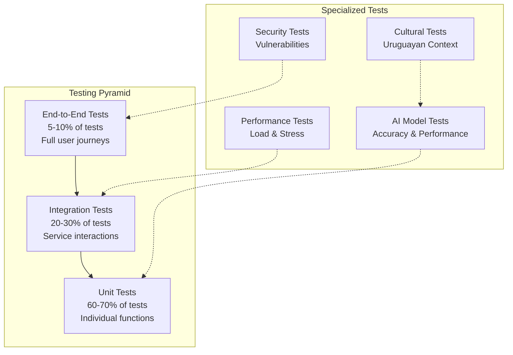

# Testing Strategy & Procedures

## Overview

This document outlines the comprehensive testing strategy for the Uruguay News Analysis System, including unit tests, integration tests, end-to-end tests, and performance tests. Our testing approach ensures reliability, accuracy, and performance of the AI-powered news analysis platform.

## Testing Philosophy

### Core Principles
- **Test-Driven Development**: Write tests before implementing features
- **Comprehensive Coverage**: 80%+ code coverage for business logic
- **AI Model Testing**: Rigorous testing of machine learning models
- **Cultural Accuracy**: Validate Uruguayan Spanish understanding
- **Performance Benchmarks**: Continuous performance monitoring

### Testing Pyramid


## Unit Testing

### Test Structure
```python
# Test organization and structure
import pytest
from unittest.mock import Mock, patch, MagicMock
from datetime import datetime, timedelta

from uruguay_news.services.sentiment import SentimentAnalyzer
from uruguay_news.models.analysis import SentimentResult
from uruguay_news.exceptions import ValidationError, ProcessingError

class TestSentimentAnalyzer:
    """Comprehensive test suite for sentiment analysis"""
    
    @pytest.fixture
    def analyzer(self):
        """Create sentiment analyzer instance"""
        return SentimentAnalyzer()
    
    @pytest.fixture
    def uruguayan_texts(self):
        """Sample Uruguayan Spanish texts for testing"""
        return {
            'positive': [
                "Excelente noticia para el país",
                "Gran avance en la economía uruguaya",
                "Celebramos este logro histórico"
            ],
            'negative': [
                "Grave crisis en el sector público",
                "Preocupante situación económica",
                "Lamentable decisión del gobierno"
            ],
            'neutral': [
                "El presidente anunció nuevas medidas",
                "La sesión parlamentaria comenzó a las 9",
                "Los datos fueron publicados ayer"
            ]
        }
    
    def test_positive_sentiment_analysis(self, analyzer, uruguayan_texts):
        """Test positive sentiment detection"""
        for text in uruguayan_texts['positive']:
            result = analyzer.analyze(text)
            
            assert isinstance(result, SentimentResult)
            assert result.score > 0.3, f"Expected positive sentiment for: {text}"
            assert result.confidence > 0.7
            assert 'positive' in result.emotions
    
    def test_negative_sentiment_analysis(self, analyzer, uruguayan_texts):
        """Test negative sentiment detection"""
        for text in uruguayan_texts['negative']:
            result = analyzer.analyze(text)
            
            assert result.score < -0.3, f"Expected negative sentiment for: {text}"
            assert result.confidence > 0.7
            assert 'negative' in result.emotions or 'concern' in result.emotions
    
    def test_neutral_sentiment_analysis(self, analyzer, uruguayan_texts):
        """Test neutral sentiment detection"""
        for text in uruguayan_texts['neutral']:
            result = analyzer.analyze(text)
            
            assert -0.3 <= result.score <= 0.3, f"Expected neutral sentiment for: {text}"
            assert result.confidence > 0.6
    
    def test_empty_text_validation(self, analyzer):
        """Test validation of empty text"""
        with pytest.raises(ValidationError, match="Text cannot be empty"):
            analyzer.analyze("")
        
        with pytest.raises(ValidationError, match="Text cannot be empty"):
            analyzer.analyze("   ")
    
    def test_text_length_limits(self, analyzer):
        """Test text length validation"""
        # Too short
        with pytest.raises(ValidationError, match="Text too short"):
            analyzer.analyze("Hi")
        
        # Too long
        long_text = "word " * 10000
        with pytest.raises(ValidationError, match="Text too long"):
            analyzer.analyze(long_text)
    
    @pytest.mark.parametrize("cultural_context,expected_adjustment", [
        ({'source': 'El País'}, 0.9),    # Conservative source
        ({'source': 'La Diaria'}, 1.1),  # Progressive source
        ({'category': 'política'}, 0.95), # Political content
        ({'region': 'Montevideo'}, 1.0),  # Urban context
    ])
    def test_cultural_context_adjustment(self, analyzer, cultural_context, expected_adjustment):
        """Test cultural context adjustments"""
        text = "Buena noticia para el país"
        
        result_without_context = analyzer.analyze(text)
        result_with_context = analyzer.analyze(text, cultural_context=cultural_context)
        
        expected_score = result_without_context.score * expected_adjustment
        assert abs(result_with_context.score - expected_score) < 0.1
    
    @patch('uruguay_news.services.sentiment.openai_client')
    def test_api_failure_handling(self, mock_openai, analyzer):
        """Test graceful handling of API failures"""
        mock_openai.chat.completions.create.side_effect = Exception("API Error")
        
        with pytest.raises(ProcessingError, match="Sentiment analysis failed"):
            analyzer.analyze("Test text")
    
    def test_performance_requirements(self, analyzer):
        """Test performance requirements"""
        text = "Este es un texto de prueba para evaluar el rendimiento"
        
        start_time = datetime.now()
        result = analyzer.analyze(text)
        end_time = datetime.now()
        
        processing_time = (end_time - start_time).total_seconds()
        assert processing_time < 0.5, f"Analysis took {processing_time}s, expected < 0.5s"
        
        # Check result quality
        assert result.confidence > 0.7
        assert result.score is not None
```

### AI Model Testing
```python
# Specialized tests for AI models
class TestAIModelAccuracy:
    """Test AI model accuracy and performance"""
    
    @pytest.fixture
    def ground_truth_dataset(self):
        """Load ground truth dataset for testing"""
        return load_test_dataset('uruguayan_news_labeled.json')
    
    @pytest.fixture
    def performance_benchmarks(self):
        """Performance benchmarks for different models"""
        return {
            'sentiment_analyzer': {
                'accuracy': 0.84,
                'precision': 0.82,
                'recall': 0.86,
                'f1_score': 0.84
            },
            'bias_detector': {
                'accuracy': 0.78,
                'precision': 0.75,
                'recall': 0.81,
                'f1_score': 0.78
            },
            'entity_recognizer': {
                'accuracy': 0.90,
                'precision': 0.88,
                'recall': 0.92,
                'f1_score': 0.90
            }
        }
    
    def test_sentiment_model_accuracy(self, ground_truth_dataset, performance_benchmarks):
        """Test sentiment model accuracy against ground truth"""
        analyzer = SentimentAnalyzer()
        
        predictions = []
        actual = []
        
        for item in ground_truth_dataset:
            if item['task'] == 'sentiment':
                result = analyzer.analyze(item['text'])
                predictions.append(result.score)
                actual.append(item['sentiment_score'])
        
        # Calculate metrics
        accuracy = calculate_accuracy(predictions, actual)
        precision = calculate_precision(predictions, actual)
        recall = calculate_recall(predictions, actual)
        f1 = calculate_f1_score(predictions, actual)
        
        benchmarks = performance_benchmarks['sentiment_analyzer']
        assert accuracy >= benchmarks['accuracy'], f"Accuracy {accuracy} below benchmark {benchmarks['accuracy']}"
        assert precision >= benchmarks['precision'], f"Precision {precision} below benchmark {benchmarks['precision']}"
        assert recall >= benchmarks['recall'], f"Recall {recall} below benchmark {benchmarks['recall']}"
        assert f1 >= benchmarks['f1_score'], f"F1 score {f1} below benchmark {benchmarks['f1_score']}"
    
    def test_bias_detection_accuracy(self, ground_truth_dataset, performance_benchmarks):
        """Test bias detection model accuracy"""
        detector = BiasDetector()
        
        predictions = []
        actual = []
        
        for item in ground_truth_dataset:
            if item['task'] == 'bias':
                result = detector.detect_bias(item['text'])
                predictions.append({
                    'score': result.score,
                    'direction': result.direction
                })
                actual.append({
                    'score': item['bias_score'],
                    'direction': item['bias_direction']
                })
        
        # Calculate bias-specific metrics
        accuracy = calculate_bias_accuracy(predictions, actual)
        
        benchmarks = performance_benchmarks['bias_detector']
        assert accuracy >= benchmarks['accuracy'], f"Bias accuracy {accuracy} below benchmark {benchmarks['accuracy']}"
    
    def test_model_consistency(self):
        """Test model consistency across multiple runs"""
        analyzer = SentimentAnalyzer()
        text = "Esta es una noticia positiva para Uruguay"
        
        results = []
        for _ in range(10):
            result = analyzer.analyze(text)
            results.append(result.score)
        
        # Calculate variance
        variance = calculate_variance(results)
        assert variance < 0.01, f"Model variance {variance} too high, expected < 0.01"
    
    def test_model_robustness(self):
        """Test model robustness to input variations"""
        analyzer = SentimentAnalyzer()
        base_text = "Excelente noticia para el país"
        
        # Test with different variations
        variations = [
            base_text.upper(),                    # All caps
            base_text.lower(),                    # All lowercase
            base_text + " " + base_text,         # Repeated text
            base_text.replace("país", "pais"),   # Missing accent
            base_text + " 123",                  # With numbers
            base_text + " !@#",                  # With special chars
        ]
        
        base_result = analyzer.analyze(base_text)
        
        for variation in variations:
            result = analyzer.analyze(variation)
            # Results should be similar (within 0.2 points)
            assert abs(result.score - base_result.score) < 0.2, f"Variation '{variation}' produced inconsistent result"
```

## Integration Testing

### API Integration Tests
```python
# Test API endpoints and service integration
import pytest
from fastapi.testclient import TestClient
from unittest.mock import patch

from main import app
from uruguay_news.models.requests import AnalysisRequest
from uruguay_news.services.auth import create_test_user

class TestArticleAnalysisAPI:
    """Test article analysis API endpoints"""
    
    @pytest.fixture
    def client(self):
        """Create test client"""
        return TestClient(app)
    
    @pytest.fixture
    def test_user(self):
        """Create test user"""
        return create_test_user(email="test@example.com", role="user")
    
    @pytest.fixture
    def auth_headers(self, test_user):
        """Create authentication headers"""
        token = auth_manager.create_access_token({"sub": test_user.id})
        return {"Authorization": f"Bearer {token}"}
    
    def test_analyze_article_endpoint(self, client, auth_headers):
        """Test article analysis endpoint"""
        # Create test article
        article_data = {
            "title": "Nuevas medidas económicas en Uruguay",
            "content": "El gobierno uruguayo anunció nuevas medidas para estimular la economía local. Estas medidas incluyen reducción de impuestos y apoyo a pequeñas empresas.",
            "source": "El País",
            "url": "https://elpais.com.uy/test-article"
        }
        
        response = client.post(
            "/api/articles/analyze",
            json=article_data,
            headers=auth_headers
        )
        
        assert response.status_code == 200
        
        result = response.json()
        assert "analysis" in result
        assert "sentiment" in result["analysis"]
        assert "bias" in result["analysis"]
        assert "entities" in result["analysis"]
        
        # Validate sentiment analysis
        sentiment = result["analysis"]["sentiment"]
        assert -1 <= sentiment["score"] <= 1
        assert 0 <= sentiment["confidence"] <= 1
        assert isinstance(sentiment["emotions"], list)
        
        # Validate bias detection
        bias = result["analysis"]["bias"]
        assert -1 <= bias["score"] <= 1
        assert bias["direction"] in ["left", "right", "center"]
        assert 0 <= bias["confidence"] <= 1
    
    def test_analyze_article_with_invalid_data(self, client, auth_headers):
        """Test API with invalid article data"""
        invalid_data = {
            "title": "",  # Empty title
            "content": "Short",  # Too short
            "source": "Invalid Source",
            "url": "invalid-url"
        }
        
        response = client.post(
            "/api/articles/analyze",
            json=invalid_data,
            headers=auth_headers
        )
        
        assert response.status_code == 422
        assert "validation_error" in response.json()
    
    def test_analyze_article_without_auth(self, client):
        """Test API without authentication"""
        article_data = {
            "title": "Test Article",
            "content": "This is a test article for unauthorized access.",
            "source": "Test Source",
            "url": "https://test.com/article"
        }
        
        response = client.post("/api/articles/analyze", json=article_data)
        
        assert response.status_code == 401
        assert "detail" in response.json()
    
    def test_analyze_article_performance(self, client, auth_headers):
        """Test API performance requirements"""
        article_data = {
            "title": "Performance Test Article",
            "content": "This is a longer article content to test performance requirements. " * 50,
            "source": "Performance Test",
            "url": "https://test.com/performance"
        }
        
        import time
        start_time = time.time()
        
        response = client.post(
            "/api/articles/analyze",
            json=article_data,
            headers=auth_headers
        )
        
        end_time = time.time()
        processing_time = end_time - start_time
        
        assert response.status_code == 200
        assert processing_time < 2.0, f"API took {processing_time}s, expected < 2.0s"
```

### Database Integration Tests
```python
# Test database operations and consistency
class TestDatabaseIntegration:
    """Test database operations and data consistency"""
    
    @pytest.fixture
    def db_client(self):
        """Create test database client"""
        return firestore.Client(project="test-project")
    
    @pytest.fixture
    def test_article(self):
        """Create test article data"""
        return {
            'id': 'test-article-123',
            'title': 'Test Article',
            'content': 'Test content for database integration testing',
            'source': 'Test Source',
            'published_at': datetime.utcnow(),
            'analysis': {
                'sentiment': {'score': 0.5, 'confidence': 0.8},
                'bias': {'score': 0.2, 'direction': 'center', 'confidence': 0.7},
                'entities': [{'name': 'Uruguay', 'type': 'LOCATION'}]
            }
        }
    
    def test_article_crud_operations(self, db_client, test_article):
        """Test CRUD operations for articles"""
        article_repo = ArticleRepository(db_client)
        
        # Create
        article_repo.create_article(test_article)
        
        # Read
        retrieved = article_repo.get_article(test_article['id'])
        assert retrieved is not None
        assert retrieved['title'] == test_article['title']
        
        # Update
        test_article['title'] = 'Updated Title'
        article_repo.update_article(test_article['id'], test_article)
        
        updated = article_repo.get_article(test_article['id'])
        assert updated['title'] == 'Updated Title'
        
        # Delete
        article_repo.delete_article(test_article['id'])
        
        deleted = article_repo.get_article(test_article['id'])
        assert deleted is None
    
    def test_query_performance(self, db_client):
        """Test database query performance"""
        article_repo = ArticleRepository(db_client)
        
        # Create multiple test articles
        for i in range(100):
            article = {
                'id': f'perf-test-{i}',
                'title': f'Performance Test Article {i}',
                'source': 'Performance Test',
                'published_at': datetime.utcnow() - timedelta(days=i),
                'analysis': {
                    'sentiment': {'score': random.uniform(-1, 1)},
                    'bias': {'score': random.uniform(-1, 1)}
                }
            }
            article_repo.create_article(article)
        
        # Test query performance
        start_time = time.time()
        results = article_repo.get_articles_by_source('Performance Test', limit=50)
        end_time = time.time()
        
        query_time = end_time - start_time
        assert query_time < 1.0, f"Query took {query_time}s, expected < 1.0s"
        assert len(results) <= 50
    
    def test_data_consistency(self, db_client):
        """Test data consistency across operations"""
        article_repo = ArticleRepository(db_client)
        
        # Create article with analysis
        article = {
            'id': 'consistency-test',
            'title': 'Consistency Test',
            'analysis': {
                'sentiment': {'score': 0.8, 'confidence': 0.9},
                'processed_at': datetime.utcnow().isoformat()
            }
        }
        
        article_repo.create_article(article)
        
        # Update analysis
        updated_analysis = {
            'sentiment': {'score': 0.6, 'confidence': 0.85},
            'bias': {'score': 0.3, 'direction': 'right'},
            'processed_at': datetime.utcnow().isoformat()
        }
        
        article_repo.update_analysis(article['id'], updated_analysis)
        
        # Verify consistency
        retrieved = article_repo.get_article(article['id'])
        assert retrieved['analysis']['sentiment']['score'] == 0.6
        assert retrieved['analysis']['bias']['score'] == 0.3
```

## End-to-End Testing

### User Journey Tests
```python
# Test complete user journeys
import pytest
from selenium import webdriver
from selenium.webdriver.common.by import By
from selenium.webdriver.support.ui import WebDriverWait
from selenium.webdriver.support import expected_conditions as EC

class TestUserJourneys:
    """Test complete user journeys through the application"""
    
    @pytest.fixture
    def driver(self):
        """Create web driver instance"""
        options = webdriver.ChromeOptions()
        options.add_argument('--headless')
        driver = webdriver.Chrome(options=options)
        yield driver
        driver.quit()
    
    @pytest.fixture
    def test_user_credentials(self):
        """Test user credentials"""
        return {
            'email': 'test@example.com',
            'password': 'testpassword123'
        }
    
    def test_complete_analysis_workflow(self, driver, test_user_credentials):
        """Test complete article analysis workflow"""
        # Navigate to application
        driver.get("http://localhost:3000")
        
        # Login
        self.login_user(driver, test_user_credentials)
        
        # Navigate to analysis page
        analysis_button = WebDriverWait(driver, 10).until(
            EC.element_to_be_clickable((By.ID, "analyze-button"))
        )
        analysis_button.click()
        
        # Input article URL
        url_input = driver.find_element(By.ID, "article-url")
        url_input.send_keys("https://elpais.com.uy/test-article")
        
        # Start analysis
        analyze_button = driver.find_element(By.ID, "start-analysis")
        analyze_button.click()
        
        # Wait for results
        results_container = WebDriverWait(driver, 30).until(
            EC.presence_of_element_located((By.ID, "analysis-results"))
        )
        
        # Verify results are displayed
        sentiment_score = driver.find_element(By.CLASS_NAME, "sentiment-score")
        assert sentiment_score.is_displayed()
        
        bias_indicator = driver.find_element(By.CLASS_NAME, "bias-indicator")
        assert bias_indicator.is_displayed()
        
        entity_list = driver.find_element(By.CLASS_NAME, "entity-list")
        assert entity_list.is_displayed()
    
    def test_dashboard_functionality(self, driver, test_user_credentials):
        """Test dashboard functionality"""
        # Login and navigate to dashboard
        driver.get("http://localhost:3000")
        self.login_user(driver, test_user_credentials)
        
        # Check dashboard elements
        dashboard_title = driver.find_element(By.H1, "Dashboard")
        assert dashboard_title.is_displayed()
        
        # Check trend charts
        trend_chart = WebDriverWait(driver, 10).until(
            EC.presence_of_element_located((By.CLASS_NAME, "trend-chart"))
        )
        assert trend_chart.is_displayed()
        
        # Check recent articles
        recent_articles = driver.find_element(By.CLASS_NAME, "recent-articles")
        assert recent_articles.is_displayed()
        
        # Test filter functionality
        filter_dropdown = driver.find_element(By.ID, "source-filter")
        filter_dropdown.click()
        
        el_pais_option = driver.find_element(By.XPATH, "//option[text()='El País']")
        el_pais_option.click()
        
        # Wait for filtered results
        WebDriverWait(driver, 10).until(
            EC.text_to_be_present_in_element((By.CLASS_NAME, "article-source"), "El País")
        )
    
    def login_user(self, driver, credentials):
        """Helper method to login user"""
        login_button = driver.find_element(By.ID, "login-button")
        login_button.click()
        
        email_input = driver.find_element(By.ID, "email")
        email_input.send_keys(credentials['email'])
        
        password_input = driver.find_element(By.ID, "password")
        password_input.send_keys(credentials['password'])
        
        submit_button = driver.find_element(By.ID, "submit-login")
        submit_button.click()
        
        # Wait for login to complete
        WebDriverWait(driver, 10).until(
            EC.presence_of_element_located((By.CLASS_NAME, "user-menu"))
        )
```

## Performance Testing

### Load Testing
```python
# Load testing using locust
from locust import HttpUser, task, between
import random

class NewsAnalysisUser(HttpUser):
    """Simulate user behavior for load testing"""
    
    wait_time = between(1, 3)
    
    def on_start(self):
        """Setup for each user"""
        self.login()
    
    def login(self):
        """Login user"""
        response = self.client.post("/api/auth/login", json={
            "email": "test@example.com",
            "password": "testpassword123"
        })
        
        if response.status_code == 200:
            self.token = response.json()["access_token"]
            self.client.headers.update({
                "Authorization": f"Bearer {self.token}"
            })
    
    @task(3)
    def analyze_article(self):
        """Analyze article - most common operation"""
        article_data = {
            "title": f"Test Article {random.randint(1, 1000)}",
            "content": "This is test content for load testing. " * random.randint(10, 50),
            "source": random.choice(["El País", "El Observador", "La Diaria"]),
            "url": f"https://example.com/article-{random.randint(1, 1000)}"
        }
        
        with self.client.post("/api/articles/analyze", json=article_data, catch_response=True) as response:
            if response.status_code == 200:
                result = response.json()
                if "analysis" in result:
                    response.success()
                else:
                    response.failure("Analysis not in response")
            else:
                response.failure(f"Got status code {response.status_code}")
    
    @task(2)
    def get_dashboard_data(self):
        """Get dashboard data"""
        with self.client.get("/api/dashboard", catch_response=True) as response:
            if response.status_code == 200:
                response.success()
            else:
                response.failure(f"Got status code {response.status_code}")
    
    @task(1)
    def get_trending_articles(self):
        """Get trending articles"""
        with self.client.get("/api/articles/trending", catch_response=True) as response:
            if response.status_code == 200:
                response.success()
            else:
                response.failure(f"Got status code {response.status_code}")
```

### Stress Testing
```python
# Stress testing for system limits
import asyncio
import aiohttp
import time
from concurrent.futures import ThreadPoolExecutor

class StressTest:
    """Stress test the system to find breaking points"""
    
    def __init__(self, base_url: str):
        self.base_url = base_url
        self.results = []
    
    async def stress_test_analysis_endpoint(self, concurrent_requests: int = 100):
        """Stress test the analysis endpoint"""
        
        async with aiohttp.ClientSession() as session:
            tasks = []
            
            for i in range(concurrent_requests):
                task = self.send_analysis_request(session, i)
                tasks.append(task)
            
            start_time = time.time()
            results = await asyncio.gather(*tasks, return_exceptions=True)
            end_time = time.time()
            
            # Analyze results
            successful = sum(1 for r in results if not isinstance(r, Exception))
            failed = len(results) - successful
            total_time = end_time - start_time
            
            print(f"Stress Test Results:")
            print(f"Concurrent requests: {concurrent_requests}")
            print(f"Successful: {successful}")
            print(f"Failed: {failed}")
            print(f"Total time: {total_time:.2f}s")
            print(f"Requests per second: {len(results) / total_time:.2f}")
            
            return {
                'concurrent_requests': concurrent_requests,
                'successful': successful,
                'failed': failed,
                'total_time': total_time,
                'rps': len(results) / total_time
            }
    
    async def send_analysis_request(self, session: aiohttp.ClientSession, request_id: int):
        """Send individual analysis request"""
        
        article_data = {
            "title": f"Stress Test Article {request_id}",
            "content": "This is stress test content. " * 20,
            "source": "Stress Test",
            "url": f"https://example.com/stress-{request_id}"
        }
        
        try:
            async with session.post(
                f"{self.base_url}/api/articles/analyze",
                json=article_data,
                timeout=aiohttp.ClientTimeout(total=30)
            ) as response:
                if response.status == 200:
                    return await response.json()
                else:
                    raise Exception(f"HTTP {response.status}")
        except Exception as e:
            raise Exception(f"Request {request_id} failed: {e}")
```

## Test Configuration

### pytest Configuration
```ini
# pytest.ini
[tool:pytest]
testpaths = tests
python_files = test_*.py
python_classes = Test*
python_functions = test_*
addopts = 
    --strict-markers
    --strict-config
    --verbose
    --cov=src
    --cov-report=html
    --cov-report=term-missing
    --cov-fail-under=80
markers =
    unit: Unit tests
    integration: Integration tests
    e2e: End-to-end tests
    performance: Performance tests
    slow: Slow tests
    ai: AI model tests
    cultural: Cultural context tests
```

### Test Data Management
```python
# Test data fixtures and management
import pytest
import json
from pathlib import Path

class TestDataManager:
    """Manage test data and fixtures"""
    
    @staticmethod
    def load_test_articles() -> list:
        """Load test articles from JSON file"""
        data_path = Path(__file__).parent / "data" / "test_articles.json"
        with open(data_path, 'r', encoding='utf-8') as f:
            return json.load(f)
    
    @staticmethod
    def load_ground_truth_data() -> dict:
        """Load ground truth data for model testing"""
        data_path = Path(__file__).parent / "data" / "ground_truth.json"
        with open(data_path, 'r', encoding='utf-8') as f:
            return json.load(f)
    
    @staticmethod
    def create_test_user(email: str, role: str = "user") -> dict:
        """Create test user data"""
        return {
            "id": f"test-user-{hash(email)}",
            "email": email,
            "role": role,
            "created_at": datetime.utcnow().isoformat(),
            "is_active": True
        }

# Global fixtures
@pytest.fixture(scope="session")
def test_articles():
    """Load test articles for the entire test session"""
    return TestDataManager.load_test_articles()

@pytest.fixture(scope="session")
def ground_truth_data():
    """Load ground truth data for model testing"""
    return TestDataManager.load_ground_truth_data()
```

## Continuous Integration

### GitHub Actions Workflow
```yaml
# .github/workflows/test.yml
name: Test Suite

on:
  push:
    branches: [main, develop]
  pull_request:
    branches: [main]

jobs:
  unit-tests:
    runs-on: ubuntu-latest
    
    steps:
      - uses: actions/checkout@v3
      
      - name: Set up Python
        uses: actions/setup-python@v4
        with:
          python-version: '3.11'
      
      - name: Install UV
        run: curl -LsSf https://astral.sh/uv/install.sh | sh
      
      - name: Install dependencies
        run: uv sync
      
      - name: Run unit tests
        run: uv run pytest tests/unit/ -v --cov=src --cov-report=xml
      
      - name: Upload coverage to Codecov
        uses: codecov/codecov-action@v3
        with:
          file: ./coverage.xml
  
  integration-tests:
    runs-on: ubuntu-latest
    needs: unit-tests
    
    services:
      redis:
        image: redis:7
        ports:
          - 6379:6379
      
      firestore:
        image: google/cloud-sdk:latest
        ports:
          - 8080:8080
        env:
          FIRESTORE_EMULATOR_HOST: localhost:8080
    
    steps:
      - uses: actions/checkout@v3
      
      - name: Set up Python
        uses: actions/setup-python@v4
        with:
          python-version: '3.11'
      
      - name: Install dependencies
        run: uv sync
      
      - name: Run integration tests
        run: uv run pytest tests/integration/ -v
        env:
          REDIS_URL: redis://localhost:6379
          FIRESTORE_EMULATOR_HOST: localhost:8080
  
  performance-tests:
    runs-on: ubuntu-latest
    needs: [unit-tests, integration-tests]
    
    steps:
      - uses: actions/checkout@v3
      
      - name: Set up Python
        uses: actions/setup-python@v4
        with:
          python-version: '3.11'
      
      - name: Install dependencies
        run: uv sync
      
      - name: Run performance tests
        run: uv run pytest tests/performance/ -v --benchmark-only
  
  e2e-tests:
    runs-on: ubuntu-latest
    needs: [unit-tests, integration-tests]
    
    steps:
      - uses: actions/checkout@v3
      
      - name: Set up Node.js
        uses: actions/setup-node@v3
        with:
          node-version: '18'
      
      - name: Install frontend dependencies
        run: npm ci
        working-directory: ./frontend/web
      
      - name: Build frontend
        run: npm run build
        working-directory: ./frontend/web
      
      - name: Run E2E tests
        run: npm run test:e2e
        working-directory: ./frontend/web
```

## Test Reporting

### Coverage Reports
```python
# Custom coverage reporting
import coverage
import json
from pathlib import Path

class CoverageReporter:
    """Generate custom coverage reports"""
    
    def __init__(self, coverage_data_file: str = '.coverage'):
        self.cov = coverage.Coverage(data_file=coverage_data_file)
        self.cov.load()
    
    def generate_detailed_report(self) -> dict:
        """Generate detailed coverage report"""
        
        report = {
            'summary': {},
            'files': {},
            'missing_lines': {}
        }
        
        # Get summary
        total_lines = 0
        covered_lines = 0
        
        for filename in self.cov.get_data().measured_files():
            analysis = self.cov.analysis2(filename)
            
            file_lines = len(analysis.statements)
            file_covered = len(analysis.statements) - len(analysis.missing)
            
            total_lines += file_lines
            covered_lines += file_covered
            
            report['files'][filename] = {
                'lines': file_lines,
                'covered': file_covered,
                'coverage': file_covered / file_lines if file_lines > 0 else 0,
                'missing': analysis.missing
            }
            
            if analysis.missing:
                report['missing_lines'][filename] = list(analysis.missing)
        
        report['summary'] = {
            'total_lines': total_lines,
            'covered_lines': covered_lines,
            'coverage_percentage': covered_lines / total_lines if total_lines > 0 else 0
        }
        
        return report
    
    def save_report(self, report: dict, filename: str = 'coverage_report.json'):
        """Save coverage report to file"""
        with open(filename, 'w') as f:
            json.dump(report, f, indent=2)
```

## Next Steps

1. **Implement** comprehensive test suite following this strategy
2. **Set up** continuous integration pipeline
3. **Monitor** test coverage and performance
4. **Maintain** test data and fixtures
5. **Expand** AI model testing as models evolve

For more information, see:
- [Development Guidelines](guidelines.md)
- [Deployment Guide](deployment.md)
- [AI Model Documentation](../ai/sentiment.md)
- [Performance Monitoring](../ai/performance.md) 